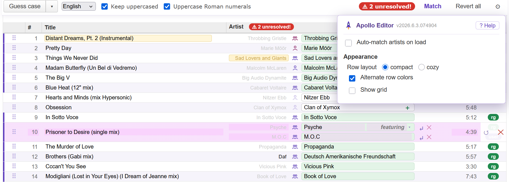
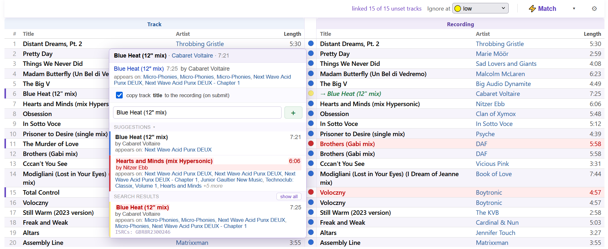

# Apollo Editor 

UI and tools for advanced adding and editing of a MusicBrainz release.

- Install: [stable](https://raw.githubusercontent.com/majkinetor/musicbrainz-userscripts/refs/heads/stable/userscripts/apollo_editor/apollo_editor.user.js) or [latest](https://raw.githubusercontent.com/majkinetor/musicbrainz-userscripts/refs/heads/main/userscripts/apollo_editor/apollo_editor.user.js)
- [Changelog](./CHANGELOG.md)

 

https://github.com/user-attachments/assets/b668f472-c3cc-4487-913c-50ff1d950c5b

When you add a release, each track's artist may be set as **plain text with no MBID**, and the recordings are unset. Linking them one by one — searching, picking, occasionally splitting *A feat. B* into two credits — is the slowest part of adding a release. Apollo Editor does the whole tracklist and recording set in one pass and lets you apply the confident matches with one click.

It replaces the native **Tracklist** and **Recordings** editors with two clean, consistent tables. It also makes **Release Information** tab more functional by suppresing help bubbles and external icons moved to right column. 

Each takeover is optional and you can flip back to the native editor at any time with the **Original / Apollo** switcher button.

## Features

- **Tracklist editor**
    - Artist picker with confidence highlight
        - Option to change all appearances of selected artist (or its *Credited as* field) with highlight
        - Ctrl-click a search result to set that artist on all unresolved tracks
        - Paste an MBID or a MusicBrainz artist URL to resolve straight to that artist
    - Split artist with join-phrase selector
    - Artist aliases in search results and in selection
    - Icon representing artist type and direct link
    - Track actions: create, split, guess case
        - Right click to execute action on all tracks
    - Reorder tracks within a medium with the ⠿ handle
    - Keyboard navigation
    - Highlighting of changed rows and split artists
- **Recordings editor**
    - Side-by-side _Track ↔ Recording_ comparison with a confidence circle per row and inline highlighting of the fields that differ.
    - Recording picker with MusicBrainz suggestions, free-form search, linked "appears on" releases, confidence highlights
    - Right-click a recording Title/Artist cell to copy the track's value down to the recording (on submit) — see [Updating recordings](#updating-recordings-titleartist)
- **[Matching](#matching)**
    - Auto-match artists and recordings in one click
    - Release group consideration for quick and precise matching
    - Configurable match tolerance — length (seconds), title (edit distance), ignore casing and punctuation
- **[Toolbar](#toolbar)**
    - Tools relocated to always-visible _Tool_ button, with some new tools
    - Revert/Clear for a single track or the whole table
- **[Customization](#settings)** — resizable columns, alternate row colors, grid, multiple layouts, match tolerance

## Matching

Apollo can automatically match unresolved **artists** and **recordings**. Both work the same way: a *Match* button, a per-row **confidence**, and the single best candidate applied automatically while anything uncertain is left out. If _Auto-match on start_ is enabled in the [settings](#matching-options), matching will be automatically started on entering add/edit release page.

### Artist matching

Apollo resolves each unmatched track artist in two stages, in order:

1. Sibling releases from same release group — it pulls the per-track credits (with MBIDs) from other versions of the album and matches by track title. Other editions usually credit the same songs to the same artists, so this resolves most cases at the highest confidence — especially various-artists compilations.
2. Name search — for anything siblings don't cover, it searches the MusicBrainz artist index by the credited name. An exact name is taken as high-confidence only when it's unambiguous; artists that share exact name are left out.

Each resolved artist is tagged by how it matched (release-group, name, pre-existing, or manual).

**Confidence levels**:

1. 🟢 Green colored artist box means the artist was matched confidently (release-group or unambiguous exact name).
1. ⚪ White search box means artist is unresolved or low-confidence, for user to pick; these are what the "N unresolved" counter counts and what clicking that badge jumps to.

### Recording matching

Apollo fetches **every recording in the release group in one request**, indexes them by title, and matches each track **locally** — choosing the highest-confidence candidate (title + artist + length). It only falls back to a per-track MusicBrainz lookup for the tracks the release group can't satisfy. A full release therefore matches in roughly one fetch rather than one request per track.

A *Credited as* values on track and recording don't influence matching.

**Confidence levels**:

| Color |     Meaning      |                               Description                               |
| :---: | ---------------- | ----------------------------------------------------------------------- |
|   🔵   | Exact            | All fields are the same                                                 |
|   🟢   | Tolerance        | Matches within tolerance defined in [settings](#matching-options)       |
|   🟡   | Near             | A single field differs, or the length gap is 3–15s (a near-miss)        |
|   🟠   | Low              | Two fields differ or the length gap alone is >15s (substantially wrong) |
|   🔴   | Very low         | All three differ and the length gap is >10s (almost certainly wrong)    |

The *Cutoff* option in the recording toolbar sets the acceptable confidence.

### Updating recordings (title/artist)

When a track's title or artist differs from its linked recording, you can copy the track's value down to the recording (applied when you submit the release — the same as the native checkboxes). Right-click the recording-side **Title** or **Artist** cell:

| Gesture | Action |
|---|---|
| **Right-click** | Toggle copy for that one cell |
| **Ctrl + right-click** | Toggle both fields (that differ) on the row |
| **Alt + right-click** | Toggle that field down the whole column (every differing row) |

While a copy is on, the cell previews `→ New ` followed by the recording's ~~original~~ value, struck through. Cells that offer a copy carry a subtle underline; a real mismatch stays red.

This mirrors MusicBrainz's **native** update checkboxes exactly — so a copy is offered whenever the native editor would show its checkbox, **including casing-only differences** that Apollo's match tolerance / *Ignore casing* setting would otherwise treat as a match. The tolerance settings still drive the confidence colouring; they no longer hide the copy. Right-clicking a recording cell with no difference does nothing (the browser's context menu is suppressed there).

## Toolbar

| Control | Default | What it does |
|---|---|---|
| **Change** | all matching tracks | Apply edit/selection to just the edited track or propagate to every track with the same credit |
| **⚡ Match** | — | Match all still-unresolved track artists or recordings (used when *Auto-match on start* is off)|
| **▾** | — | **↺ Revert all** — every track back to page-load state **✕ Clear all** — empty all artists in tracklist or set new recordings|
| **Tool** | last used | A single always-visible button holding all the tools. The last tool used becomes the default |
| **Cutoff** | 🟡 near | Matches only records at or above the chosen confidence level and leave other unmatched |

### Tools

Native tools are hidden and moved to the single **Tool** button at the top of the table that stays always visible. All tools are reachable from the button's menu and the last one used becomes the default. Tools with parameters show them next to the button; parameterless tools fire on pick.

Besides the integrated tools, there are a few new ones:

- **Search & Replace** — search a string within track titles and replace it. Clicking the button starts a fresh session with any existing parameters applied and cleared.
- **Resize Columns** — set column sizes to predefined variants (auto-fit, centered, default).

## Settings

Accessed using the **⚙** button on the interface switcher button **Original / Apollo**.

Settings are saved in the browser (localStorage) and persist across releases.

### Modify

If any of the following options is on, script replaces the native interface elements for the Apollo versions:

- Modify Release Information
- Modify Tracklist
- Modify Recordings
- Modify header and footer
- Zen editing

All configured modifications are toggled on/off using the switcher button.

### Matching options

| Option | Default | What it does |
|---|---|---|
| **Auto-match on start**| On On | **Tracklist** - Matches artists automatically when the page loads **Recordings** - Matches recordings automatically when the page loads|
|**Length tolerance**|5| Allow a length gap within N seconds (use `0` for exact)|
|**Title tolerance**|1| Allow up to N differing characters in the title (use `0` for exact)|
|**Ignore casing** |On|Case / accent / spacing-only differences don't count|
|**Ignore punctuation**|On| *& → and*, brackets, quotes, dashes and dots are stripped before comparing|

### Appearance

Applied to **both** tables (Tracklist and Recordings).

| Option | Default | What it does |
|---|---|---|
| **Row layout** | normal | Row density: `compact` (tight) · `normal` · `cozy` (airy). |
| **Alternate row colors** | Off | Tints every other row (and deepens the matched-box green on alternate rows). |
| **Show grid → columns** | Off | Vertical separators between columns. |
| **Show grid → rows** | On | Horizontal lines between tracks. |

## Keyboard 

|         Key         |            Description            |
| ------------------- | --------------------------------- |
| Down, \<ENTER\>     | focus cell in the next row        |
| Up, SHIFT+\<ENTER\> | focus cell in the previous row    |
| Tab                 | focus cell in the next column     |
| SHIFT+Tab           | focus cell in the previous column |

## Persistence

These are remembered automatically as you use the UI:

- **Column widths** — drag a column border to resize; reset/auto-fit via the **Resize Columns** tool.
- **Suggestions collapsed** — the picker remembers whether its *suggestions* section is collapsed.
- **Last tool used** — becomes the default action of the **Tool** button.
- **Apply mode**, **Cuttoff**, and all dialog options above — saved on change.
