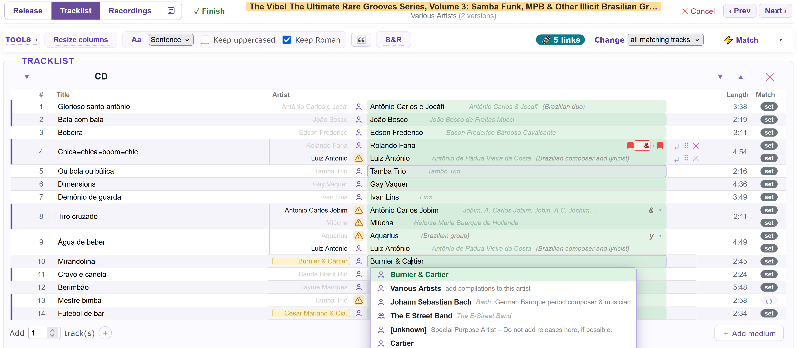
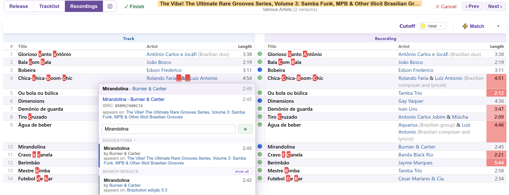
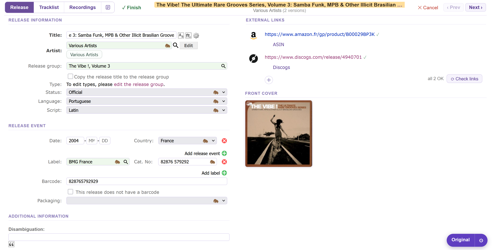
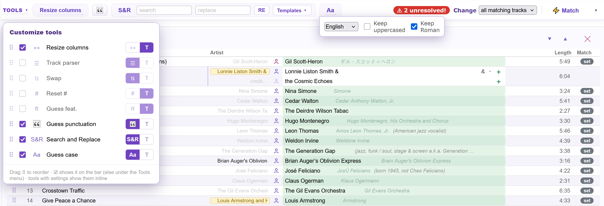
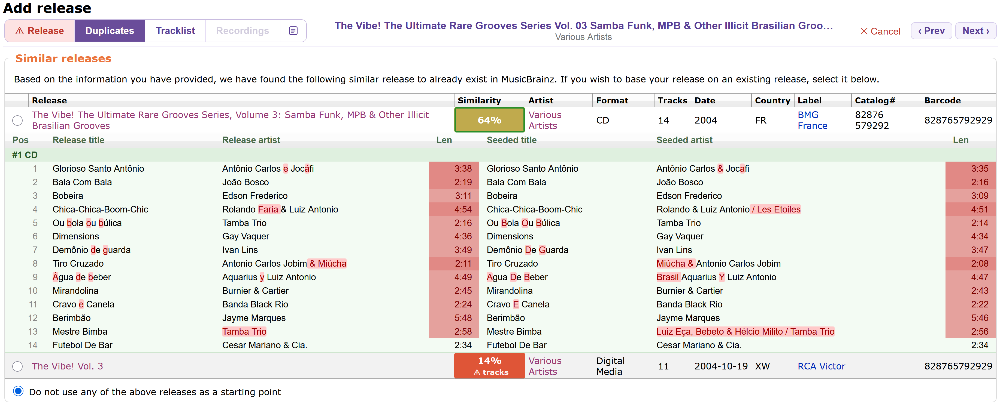
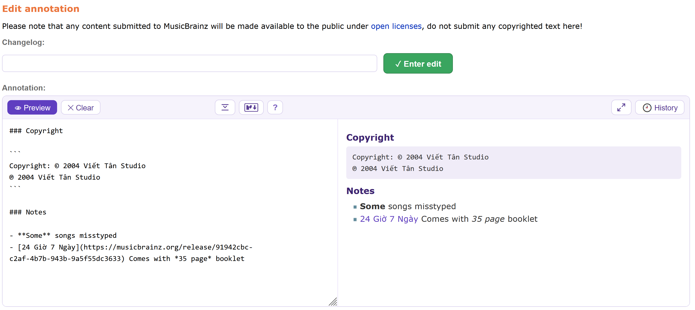

# Apollo Editor 

UI and tools for advanced adding and editing of a MusicBrainz release.

- Install: [stable](https://raw.githubusercontent.com/majkinetor/musicbrainz-userscripts/refs/heads/stable/userscripts/apollo_editor/apollo_editor.user.js) or [latest](https://raw.githubusercontent.com/majkinetor/musicbrainz-userscripts/refs/heads/main/userscripts/apollo_editor/apollo_editor.user.js)
- [Changelog](./CHANGELOG.md)
- [View users](https://musicbrainz.org/search/edits?auto_edit_filter=&order=desc&negation=0&combinator=and&conditions.1.field=edit_note_content&conditions.1.operator=includes&conditions.1.args.0=Apollo+Editor)

 
<details><summary>More screenshots</summary>
<br>
<br>



</details>

When you add a release, each track's artist may be set as **plain text with no MBID**, and the recordings are unset. Linking them one by one — searching, picking, occasionally splitting *A feat. B* into two credits — is the slowest part of adding a release. Apollo Editor does the whole tracklist and recording set in one pass and lets you apply the confident matches with one click.

It replaces the native **Tracklist** and **Recordings** editors with two clean, consistent tables with dozen of features. It also makes **Release Information** tab more functional by suppresing help bubbles and external icons moved to right column. When adding new releases, **Duplicates** tab provides similarity check.

Each takeover is optional and you can flip back to the native editor at any time with the **Original / Apollo** switcher button.

## Features

- **[Tracklist editor](#tracklist-editor)** — clean artist-picker table with confidence highlighting, change-all-matching scope, split/alias-aware credits, track actions, reordering and keyboard navigation.
- **[Recordings editor](#recordings-editor)** — side-by-side *Track ↔ Recording* comparison with per-row confidence, character-level diff highlighting, and a suggestion/ISRC-aware recording picker.
- **[Matching](#matching)** — one-click auto-match of artists and recordings, using the whole release group, with configurable tolerance.
- **[Toolbar](#toolbar)** — configurable **Tools** bar (choose/reorder, icon or text, hover-flyout params) plus extra tools, and Revert/Clear for one track or all.
- **[Release Information](#release-information)** — Markdown annotation editor, external links in a right column with a dead-link checker, and a front-cover thumbnail.
- **[Duplicates](#duplicates)** — a red→green **Similarity** score per existing release, expandable to a track-by-track comparison.
- **[Customization](#settings)** — resizable columns, alternate row colours, grid, layouts and match tolerance.
- **Original / Apollo switcher** — every takeover is optional; flip back to the native editor at any time.

## Tracklist editor

- Artist picker with a confidence highlight; apply to **all matching tracks or a single one** (the [Change](#toolbar) scope).
- **Ctrl-click** a search result to set that artist on every unresolved track.
- Paste an **MBID or a MusicBrainz artist URL** to resolve straight to that artist.
- **Split** an artist with a join-phrase selector.
- Artist **aliases** shown in search results and in the selection.
- Icon for the **artist type**, with a direct link to the artist.
- **Track actions** — create, split, guess case; **right-click** to run the action on every track.
- **Reorder** tracks within a medium with the ⠿ handle.
- **Keyboard navigation**, and highlighting of changed rows and split artists.
- **Expand all media** — a release with many media loads with most collapsed; **right-click** a medium's expand arrow (Tracklist) or its expand row (Recordings) to expand **every** collapsed medium at once. Left-click still expands just that one.

## Recordings editor

- **Side-by-side _Track ↔ Recording_ comparison** with a confidence circle per row and inline highlighting of the fields that differ.
- **Detailed highlighting** (opt-in, _Matching_ settings) — highlights the exact **differing characters** in a mismatching **title and artist** (including a casing- or punctuation-only difference the match would otherwise tolerate), instead of the whole field, and shades a **length mismatch** by how large the gap is (faint under a second → solid red past five).
- **Confusable / invisible characters** — wherever a **title or artist** is shown as text (the recordings comparison, the recording picker — **not** only inside a detailed-highlight diff) every confusable or invisible character (a straight `'` `"` `-`, a curly `’`, an en/em dash, a no-break or zero-width space, a tab, …) is **enlarged**, names its exact codepoint on hover, and draws invisibles as a visible glyph, so the exact character is obvious in any situation. Size is the _Appearance → Enlarge punctuation by N px_ setting (`0` = off, the master switch). On the **Tracklist** tab the **Title** can't be styled while it's an editable `<input>`, so it's shown as styled read-only text that **drops into the native input the moment you click or tab into it** (and returns to the styled view on blur) — you get the visibility without losing inline editing.
- **Join-phrase spacing** — a join phrase between two artists should have a space on both sides (`" & "`). Where one is **missing** a highlighted `␣` is drawn (`Gandhabba &␣Render`), and a join phrase **missing entirely** between two artists shows `␣?␣` — on both the **Recordings** comparison and the **Tracklist** artist column (where the join input is outlined and flagged). Shares the _Enlarge punctuation_ master switch (`0` = off).
- **Recording picker** — MusicBrainz suggestions, free-form search, linked "appears on" releases and confidence highlights.
  - Paste a **recording MBID** or a MusicBrainz `/recording/<mbid>` URL into the search field to link that recording immediately (same as the artist picker).
  - Paste an **ISRC** (with or without separators, e.g. `GB-AYE-06-01498` or `GBAYE0601498`) to resolve it via MusicBrainz — a single match links immediately, several are listed to choose from. The linked recording's ISRC(s) show in the picker header so it's clear when an ISRC drove the selection.
- **Copy a track value down to the recording** — right-click a recording Title/Artist cell (applied on submit); see [Updating recordings](#updating-recordings-titleartist).

## Matching

Apollo can automatically match unresolved **artists** and **recordings**. Both work the same way: a *Match* button, a per-row **confidence**, and the single best candidate applied automatically while anything uncertain is left out. If _Auto-match on start_ is enabled in the [settings](#matching-options), matching will be automatically started on entering add/edit release page.

### Artist matching

Apollo resolves each unmatched track artist in two stages, in order:

1. Sibling releases from same release group — it pulls the per-track credits (with MBIDs) from other versions of the album and matches by track title. Other editions usually credit the same songs to the same artists, so this resolves most cases at the highest confidence — especially various-artists compilations.
2. Name search — for anything siblings don't cover, it searches the MusicBrainz artist index by the credited name. An exact name is taken as high-confidence only when it's unambiguous; artists that share exact name are left out.

Each resolved artist is tagged by how it matched (release-group, name, pre-existing, or manual).

**Confidence levels**:

1. 🟢 Green colored artist box means the artist was matched confidently (release-group or unambiguous exact name).
1. ⚪ White search box means artist is unresolved or low-confidence, for user to pick; these are what the "N unresolved" counter counts and what clicking that badge jumps to.

### Discogs artist links

When the release carries a **Discogs link** (read from the page), Apollo uses it for artists — controlled by the *Discogs artist link matching* [setting](#matching-options) (on by default).

- **Match by Discogs URL.** Before the name search, each track artist is matched by its Discogs URL (taken from the release's Discogs tracklist) against MusicBrainz's URL relationships — a strong, human-verified signal. A single linked MB artist is applied directly with a teal **DISC** badge; several linked artists are offered as candidates to pick from.
- **Add / create the link.** For a slot whose Discogs URL is known, the artist-type icon becomes an actionable Discogs icon when there's something to do — click it to act:
  - unresolved slot → **teal 🔗**: creates the artist seeded with the Discogs link (same as `＋`);
  - matched artist with **no** Discogs link → **teal 🔗**: adds it (opens the artist's edit form pre-seeded, confirmed on return);
  - the Discogs URL already links a **different** MB artist (conflict) → **amber ⚠**: clicking still adds it to this artist, but you're warned which artist it currently points to;
  - the artist already links a **different** Discogs page than the release credits (mismatch) → **amber ⚠**: the tooltip names both pages, and clicking adds the release's link to the artist anyway. A mismatch often means the wrong artist was matched, so it's worth a look first.
- **Badge.** A teal **🔗 N links** badge in the toolbar counts the artists whose Discogs link needs attention — **missing + mismatched** (the tooltip breaks it down). It stays until they're resolved; each click steps to the next such track and focuses its credit field. Adding a link updates every track crediting that same artist at once.

Already-linked artists are verified for free via MusicBrainz's internal entity endpoint, so the rate-limited URL lookup only runs for artists actually missing a link — a fully-linked release is near-instant. Clearing or reverting all artists doesn't trigger a re-check (it runs again when you Match).

### Recording matching

Apollo fetches **every recording in the release group in one request**, indexes them by title, and matches each track **locally** — choosing the highest-confidence candidate (title + artist + length). It only falls back to a per-track MusicBrainz lookup for the tracks the release group can't satisfy. A full release therefore matches in roughly one fetch rather than one request per track.

A *Credited as* values on track and recording don't influence matching.

**Confidence levels**:

| Color |     Meaning      |                               Description                               |
| :---: | ---------------- | ----------------------------------------------------------------------- |
|   🔵   | Exact            | All fields are the same                                                 |
|   🟢   | Tolerance        | Matches within tolerance defined in [settings](#matching-options)       |
|   🟡   | Near             | A single field differs, or the length gap is 3–15s (a near-miss)        |
|   🟠   | Low              | Two fields differ or the length gap alone is >15s (substantially wrong) |
|   🔴   | Very low         | All three differ and the length gap is >10s (almost certainly wrong)    |

The *Cutoff* option in the recording toolbar sets the acceptable confidence.

### Updating recordings (title/artist)

When a track's title or artist differs from its linked recording, you can copy the track's value down to the recording (applied when you submit the release — the same as the native checkboxes). Right-click the recording-side **Title** or **Artist** cell:

| Gesture | Action |
|---|---|
| **Right-click** | Toggle copy for that one cell |
| **Ctrl + right-click** | Toggle both fields (that differ) on the row |
| **Alt + right-click** | Toggle that field down the whole column (every differing row) |

While a copy is on, the cell previews `→ New ` followed by the recording's ~~original~~ value, struck through. Cells that offer a copy carry a subtle underline; a real mismatch stays red.

This mirrors MusicBrainz's **native** update checkboxes exactly — so a copy is offered whenever the native editor would show its checkbox, **including casing-only differences** that Apollo's match tolerance / *Ignore casing* setting would otherwise treat as a match. The tolerance settings still drive the confidence colouring; they no longer hide the copy. Right-clicking a recording cell with no difference does nothing (the browser's context menu is suppressed there).

### Video recordings

A recording that's flagged as a **video** shows a small video-camera marker next to its name in the recording column (mirroring the native recordings table), so video recordings — easy to miss when checking for incorrectly linked or merged ones — stand out.

## Duplicates

When you add a release, MusicBrainz's **Duplicates** tab lists existing releases you might want to *base your release on*. Apollo augments that native table (controlled by the **Modify Duplicates** [setting](#modify), **on by default**):

- A **Similarity** column scores how closely each existing release matches the one you're entering — a folded-title ratio, softened by an **artist** mismatch (×0.75) and a **track-count** gap — rendered as a **red→green** percentage.
- **Click a score** to expand a **track-by-track comparison** beneath the row: each track's *Release* (the existing release) vs *Seeded* (what you're entering) **artist**, **title** and **length**, grouped by medium. It reuses the [detailed recordings highlighting](#recordings-editor) — per-character **title and artist** diffs and a **graded length shade** (faint under a second → solid red past five). Click again to collapse.

The score is computed from the data shown in the native row (no extra requests); the comparison fetches the existing release's tracklist on demand when you open it.

## Toolbar

| Control | Default | What it does |
|---|---|---|
| **Change** | all matching tracks | Scope of **every** artist action (pick, *Credited as*, join, add/remove/reorder/split): apply to just the edited track, or propagate to every track sharing the same artist credit (whole-credit match, like MB's native "change all matching tracks") |
| **⚡ Match** | — | Match all still-unresolved track artists or recordings (used when *Auto-match on start* is off)|
| **▾** | — | **↺ Revert all** — every track back to page-load state<br>**✕ Clear all** — empty all artists in tracklist or set new recordings|
| **Tools** | — | The tools you choose, each shown at its place on the bar. Tools you don't put on the bar live under the **Tools ▾** menu, which also holds **Customize…** |
| **Cutoff** | 🟡 near | Matches only records at or above the chosen confidence level and leave other unmatched |

### Tools

Native tools are hidden and replaced by a configurable **Tools** bar. Every tool put on the bar renders inline at its place — a plain button when it has no settings, or a small group (a clickable name/icon that runs the tool, followed by its parameters) when it does. Parameterless tools (e.g. *Guess feat.*) just fire on click.

The **Tools ▾** label opens a menu of the tools that *haven't* been put on the bar. Picking a tool from that menu uses it right away; a tool with parameters joins the bar **for the current session** so its controls are reachable — it returns to the menu next time (use Customize to keep it).

**Customize…** lets you, per tool:

- **Show on the bar** — tick which tools sit on the bar; the rest stay in the **Tools ▾** menu.
- **Reorder** — drag the ☰ handle to set the order (a line shows where the tool will land).
- **Icon / text** — toggle the `[icon]` and `[text]` segments to show either or both (at least one).

**Collapsing a tool's parameters.**<br>
Right-click a tool's name to collapse it to just the name (dotted underline); its parameters then **fly out on hover** (and stay open while you're typing in them). Right-click again to pin them back inline. The collapsed/expanded choice is remembered per tool.

Besides the integrated tools, there are a few new ones:

- **Search & Replace** — search a string within track titles and replace it. Clicking the tool name starts a fresh session with the current options applied and the fields cleared.
- **Resize Columns** — set column sizes to predefined variants (Fit, Centered, Default).

External tools (need another userscript):

- **Guess punctuation** — runs kellnerd's [guess-unicode-punctuation](https://github.com/kellnerd/musicbrainz-scripts#guess-unicode-punctuation) (curly quotes, dashes, ellipses…) over the release. **Requires that script installed** — the tool only appears when it is.

#### Tools from other userscripts

Apollo can surface a fire-and-forget button that *another* userscript adds to the page, so you can use it without leaving the Apollo view. Such a tool behaves like any built-in one: it shows in the **Tools ▾** menu and in **Customize…**, where you can pin it to the bar, reorder it, and choose icon/text (the choice persists). It only appears while the providing script is present. Two ways in:

- **Recognised buttons** — Apollo adopts a known button *unmodified*, matched by its visible text (e.g. **Guess punctuation** above). Adopting another is a one-line registry entry in Apollo.
- **Convention (for script authors)** — tag any element `class="apollo-tool"` and Apollo offers it, no Apollo change needed:

  ```html
  <button class="apollo-tool" data-apollo-label="My tool" data-apollo-icon="★">…</button>
  ```

  - `data-apollo-label` *(optional)* — menu/button label (falls back to the element's text).
  - `data-apollo-icon` *(optional)* — a short text glyph **or** a `data:` / `http(s)` image URL (rendered as a small image); default 🔧.
  - `data-apollo-id` *(optional)* — stable id for the saved bar/menu placement (falls back to the element's `id`, then a slug of the label).

Activating either kind **clicks the element**, then Apollo re-reads the tracklist so its grid reflects the change. This fits tools that are **parameterless or pop their own settings on click** (e.g. a Track parser); tools that need their controls rendered *inline* in Apollo's bar aren't surfaced this way.


## Release Information

Apollo makes the **Release Information** tab more functional — native help bubbles are suppressed and the external-link icons move to a right column:

- The **[annotation editor](#annotation-editor)** lives here, in *Additional information*.
- **External links** moved to a right column with a **dead-link checker**; **right-click** a favicon/type to edit it.
- A **front-cover thumbnail** (from the Cover Art Archive) sits under the external links, linking to the release's cover-art page — shown only when the release actually has front art.

## Annotation editor

Edits the [annotation](https://musicbrainz.org/doc/Annotation) as **Markdown** with a live preview. It runs both in the release editor's *Additional information* section and on the standalone **Edit annotation** page (`/release/<mbid>/edit_annotation`), and is toggled by the **Modify annotations with Markdown** [setting](#modify).

Markdown format is selected by default; the underlying MusicBrainz field always holds MB markup, so **saving is always correct**.

**Toolbar** — `[Preview] [Clear]  [markup] [?]  [maximize] [History]`:

- **Preview** — a live split view: editor on the left, the annotation rendered updating in real time on the right
- **Clear** — remove all markup from text area
- **markup** —  switch between editing as Markdown and the MusicBrainz markup.
- **?** — hover for a syntax and shortcut cheatsheet.
- **maximize** — expand the editor to fill the screen (Esc restores).
- **🕘 History** — the annotation's previous versions; select one to display its rendered annotation, with a **↶ revert** button that loads that version back into the editor wit markup reconstructed from the rendered HTML.

**Editing**

- **Unnamed MusicBrainz entity links are named automatically** — MB `[url]`/`[url|]`, Markdown `[]()`, or a bare URL get the entity name (fetched from the API).
- **Enter** continues the current list; **Tab** on a selection makes a bullet list (Tab again → numbered, again → bullet…); **Shift+Tab** removes the list marker.
- **Ctrl/Cmd+B / +I** bold/italic — wraps the selection, or surrounds the word under the cursor.
- All edits are **undoable** (`Ctrl+Z`).

The Markdown ↔ MB conversion covers links, bold/italic, headings, nested bullet/numbered lists, fenced ` ``` ` ↔ 8‑space code, rules, and encodes a non‑link `[x]` so MusicBrainz doesn't read it as a broken link.

## Settings

Accessed using the **⚙** button on the interface switcher button **Original / Apollo**.

Settings are saved in the browser (localStorage) and persist across releases.

### Modify

If any of the following options is on, script replaces the native interface elements for the Apollo versions:

- Modify Release Information
- Modify Tracklist
- Modify Recordings
- Modify Duplicates — the [Duplicates](#duplicates) similarity column + track comparison (on by default)
- Modify annotations with Markdown — the [annotation editor](#annotation-editor) (applies to both `/edit` and the standalone `/edit_annotation` page)
- Modify header and footer
- Zen editing
- Auto confirm release submissions (on by default) — when another site *seeds* the Add/Edit-release form, MusicBrainz shows a confirmation page before opening the editor; Apollo clicks its submit button so you skip that step (integrating [chaban's *Auto click confirm form submission*](https://greasyfork.org/en/scripts/536999) script). Acts only on that seed-confirmation page; add `?skip_confirmation` to a seed URL to bypass it once.

The interface modifications (everything above except *Auto confirm*) are toggled on/off together using the switcher button.

### Matching options

| Option | Default | What it does |
|---|---|---|
| **Auto-match on start**| On<br>On | **Tracklist** - Matches artists automatically when the page loads<br>**Recordings** - Matches recordings automatically when the page loads|
| **Discogs artist link matching**| On | When the release has a Discogs link, match track artists by their [Discogs URL](#discogs-artist-links) (before the name search) and offer to add/create missing links|
|**Length tolerance**|5| Allow a length gap within N seconds (use `0` for exact)|
|**Title tolerance**|1| Allow up to N differing characters in the title (use `0` for exact)|
|**Ignore casing** |On|Case / accent / spacing-only differences don't count|
|**Ignore punctuation**|On| *& → and*, brackets, quotes, dashes and dots are stripped before comparing|

### Appearance

Applied to **both** tables (Tracklist and Recordings).

| Option | Default | What it does |
|---|---|---|
| **Row layout** | normal | Row density: `compact` (tight) · `normal` · `cozy` (airy). |
| **Alternate row colors** | Off | Tints every other row (and deepens the matched-box green on alternate rows). |
| **Show grid → columns** | Off | Vertical separators between columns. |
| **Show grid → rows** | On | Horizontal lines between tracks. |

## Keyboard 

|         Key         |            Description            |
| ------------------- | --------------------------------- |
| Down, \<ENTER\>     | focus cell in the next row        |
| Up, SHIFT+\<ENTER\> | focus cell in the previous row    |
| Tab                 | focus cell in the next column     |
| SHIFT+Tab           | focus cell in the previous column |

By default, moving between cells keeps the **caret column** where it was (clamped to the destination's length) instead of selecting the whole field — so you can keep typing or fix casing at the same spot rather than overwriting. Turn off **Keep caret position on row navigation** (gear → Appearance) to restore the old behavior, where arriving on a cell selects the whole field so the next keystroke replaces it.

## Persistence

These are remembered automatically as you use the UI:

- **Column widths** — drag a column border to resize; reset/auto-fit via the **Resize Columns** tool.
- **Suggestions collapsed** — the picker remembers whether its *suggestions* section is collapsed.
- **Tools bar** — which tools are on the bar, their order, each tool's icon/text choice, and whether its parameters are collapsed.
- **Apply mode**, **Cuttoff**, and all dialog options above — saved on change.
