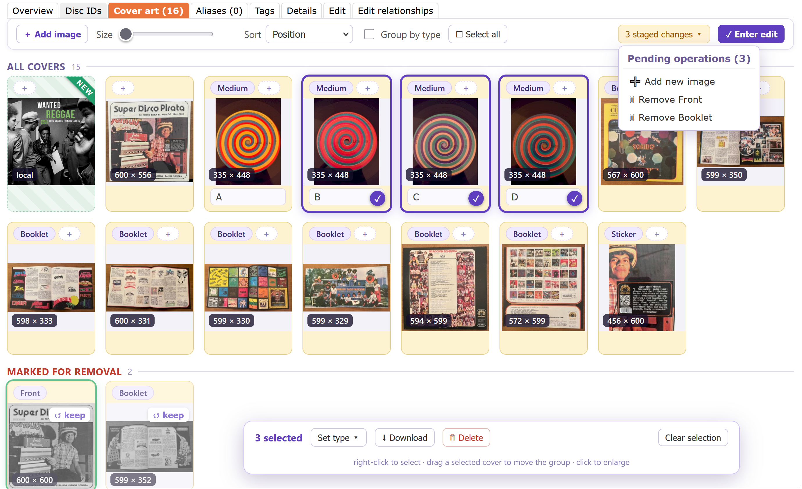

# Art Station 

A cover-art editor for MusicBrainz: one gallery to view, group, sort, reorder, retype, comment, remove, download and add a release's cover art — all staged, then applied on **Enter edit**.

- Install: [stable](https://raw.githubusercontent.com/majkinetor/musicbrainz-userscripts/refs/heads/stable/userscripts/art_station/art_station.user.js) or [latest](https://raw.githubusercontent.com/majkinetor/musicbrainz-userscripts/refs/heads/main/userscripts/art_station/art_station.user.js)

It runs on a release's **Cover art** tab (`/release/<mbid>/cover-art`), replacing the native list with a gallery. The gallery is the staged state, and **Enter edit** makes MusicBrainz match it.

## Features

- **Gallery** with an adjustable thumbnail size
- **Group by type** or a flat **Position** view
- **Sort** by position, type (Front, Back, Booklet, …), dimensions or newest.
- **Reorder** by dragging covers (Position view); drag a whole selection together.
- **Select** with right-click or right-drag; **Select all** from the toolbar.
- **Set type** and **comment** per cover, or in bulk on a selection.
- **Remove** and **Download** (a selection, or every cover).
- **Add** images by file drop — new covers upload to the Cover Art Archive, in parallel.
- **Full-screen viewer** on click: arrow-key navigation, a slideshow, and an editable comment. 
- Covers with a **pending MusicBrainz edit** are tinted and badged, like the native page.

## Applying changes

Every change is staged. **Enter edit** opens a panel that lists the pending operations and submits them as real MusicBrainz edits — remove, retype/comment, reorder and new-image uploads — each crediting *Art Station* in the edit note.

- Edits and removes run in parallel; uploads run in parallel and register in order so positions stay correct; reorder runs last.
- A shared **edit note** and **make votable** apply to every edit.

