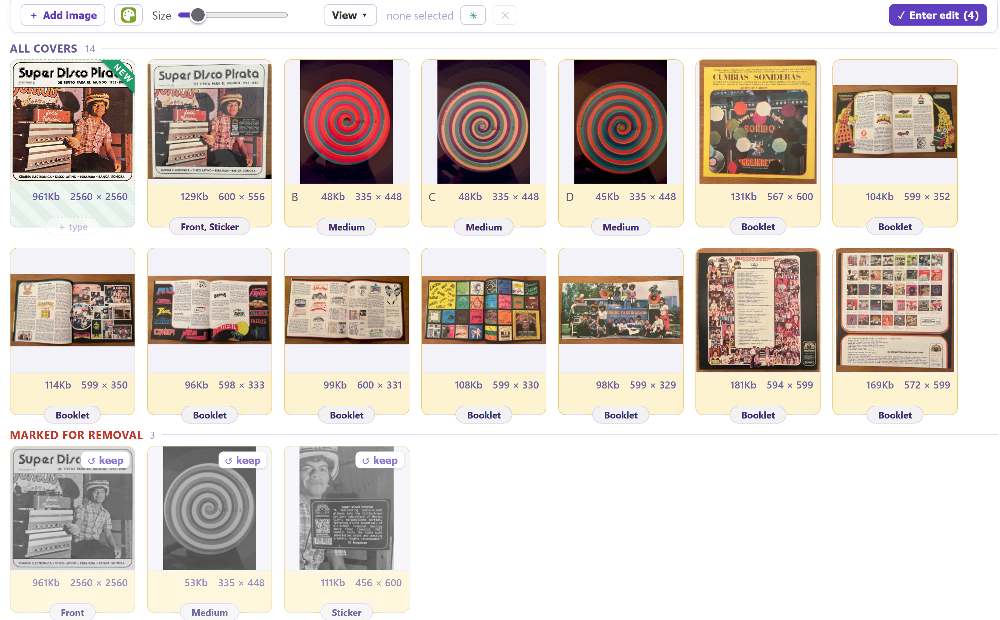
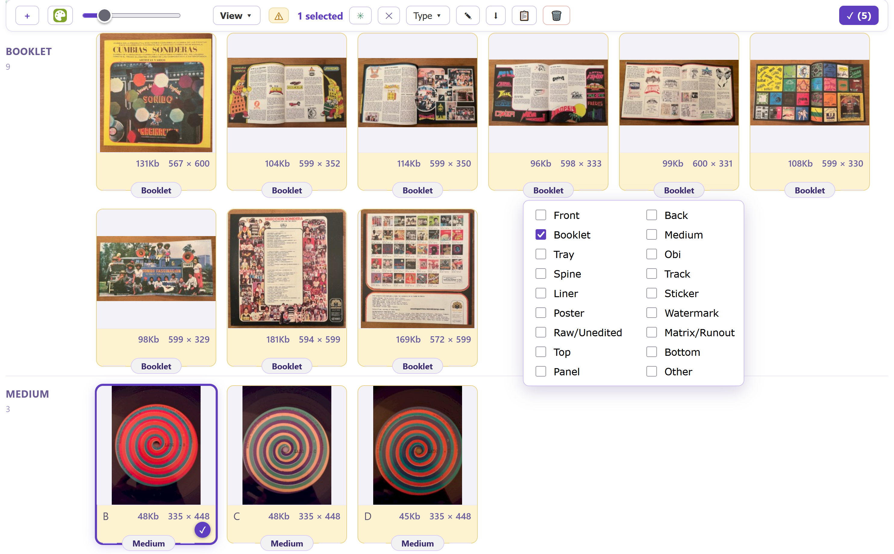
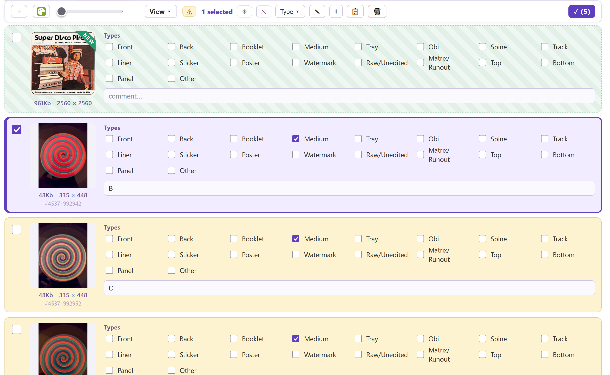

# Art Station 

A cover/event-art editor for MusicBrainz: one gallery to view, group, sort, reorder, retype, comment, remove, download, add and source a release's cover art (or an event's event art) — all staged, then applied on **Enter edit**.

- Install: [stable](https://raw.githubusercontent.com/majkinetor/musicbrainz-userscripts/refs/heads/stable/userscripts/art_station/art_station.user.js) or [latest](https://raw.githubusercontent.com/majkinetor/musicbrainz-userscripts/refs/heads/main/userscripts/art_station/art_station.user.js)

More Screenshots

  

It runs on a release's **Cover art** tab (`/release/<mbid>/cover-art`) and an event's **Event art** tab (`/event/<gid>/event-art`), replacing the native list with a gallery. The gallery is the staged state, and **Enter edit** makes MusicBrainz match it.

## Features

- **Gallery** with an adjustable thumbnail size
- **Group by type** or a flat **Position** view
- **Sort** by position, type (Front, Back, Booklet, …), dimensions or newest.
- **Reorder** by dragging covers (Position view); drag a whole selection together.
- **Select** with right-click or right-drag; **Select all** from the toolbar.
- **Set type** and **comment** per cover, or in bulk on a selection.
- **Remove** and **Download** (a selection, or every cover).
- **Add** images by file drop — new covers upload to the Cover Art Archive, in parallel.
- **Source from [MH Covers](https://covers.musichoarders.xyz)** (releases only): pick a cover on covers.musichoarders.xyz and it drops into the gallery as a staged new cover, via the sanctioned integration. Cancel an in-flight upload from the **Enter edit** panel.
- **Full-screen viewer** on click: arrow-key navigation, a slideshow, an editable comment, set-type, and `Delete` to remove — all without leaving the viewer.
- Covers with a **pending MusicBrainz edit** are tinted and badged, like the native page.

## Events

The same gallery works on an event's **Event art** tab. Everything is identical except the vocabulary — event-art types are *Poster, Flyer, Banner, Program, Setlist, Schedule, Ticket, Map, Logo, Merchandise, Raw/Unedited, Watermark* — and the MH Covers source button (release-cover only) is hidden.

> **Note:** sourcing from MH Covers fetches images cross-origin, so the script declares `@grant GM.xmlHttpRequest` + `@connect *`; your userscript manager will prompt for cross-origin access the first time you use it. The script uses no page-globals, so the sandbox switch is safe.

## Applying changes

Every change is staged. **Enter edit** opens a panel that lists the pending operations and submits them as real MusicBrainz edits — remove, retype/comment, reorder and new-image uploads — each crediting *Art Station* in the edit note.

- Edits and removes run in parallel; uploads run in parallel and register in order so positions stay correct; reorder runs last.
- A shared **edit note** and **make votable** apply to every edit.

