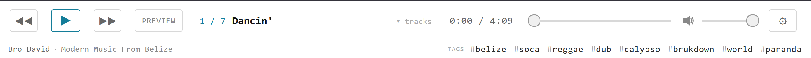
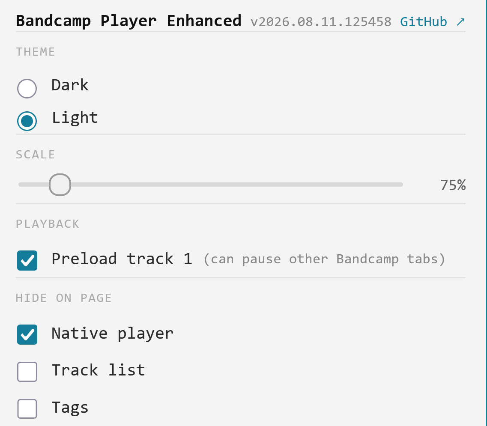

# Bandcamp Player Enhanced 

Bandcamp album player with keyboard shortcuts.

## Shortcuts

Control bandcamp player with keyboard:

| Key        | Function                                                       |
| ---------- | -------------------------------------------------------------- |
| Space      | Toggle play/pause                                              |
| ArrowUp    | Prevous song, with SHIFT volume up                             |
| ArrowDown  | Next song, with SHIFT volume down                              |
| ArrowLeft  | Rewind 5 or 30 (with SHIFT) seconds, mouse scroll over player  |
| ArrowRight | Forward 5 or 30 (with SHIFT) seconds, mouse scroll over player |
| P          | Album preview (30s per song)                                   |

Mouse wheel over the player bar seeks the same way. Exceptions: wheel over an open track list
scrolls the list, and wheel over the volume control adjusts volume instead.

## Settings

Click the ⚙ button on the player bar to open its settings:

- **Theme** — Light (default) or Dark
- **Scale** — 70%–130% (default 100%)
- **Playback** — **Preload track 1** (default on): loads and briefly (muted) plays the first
  track on page load so it's instantly ready. Turn this off if you keep several Bandcamp album
  tabs open — Bandcamp treats that brief playback as "this tab started playing" and can pause
  a genuinely-playing tab elsewhere.
- **Hide on page** — which native page elements get hidden: the native Bandcamp player (hidden
  by default, since this bar replaces it), the track list, and the tags row (both visible by
  default).

Choices apply immediately and persist across page loads.

