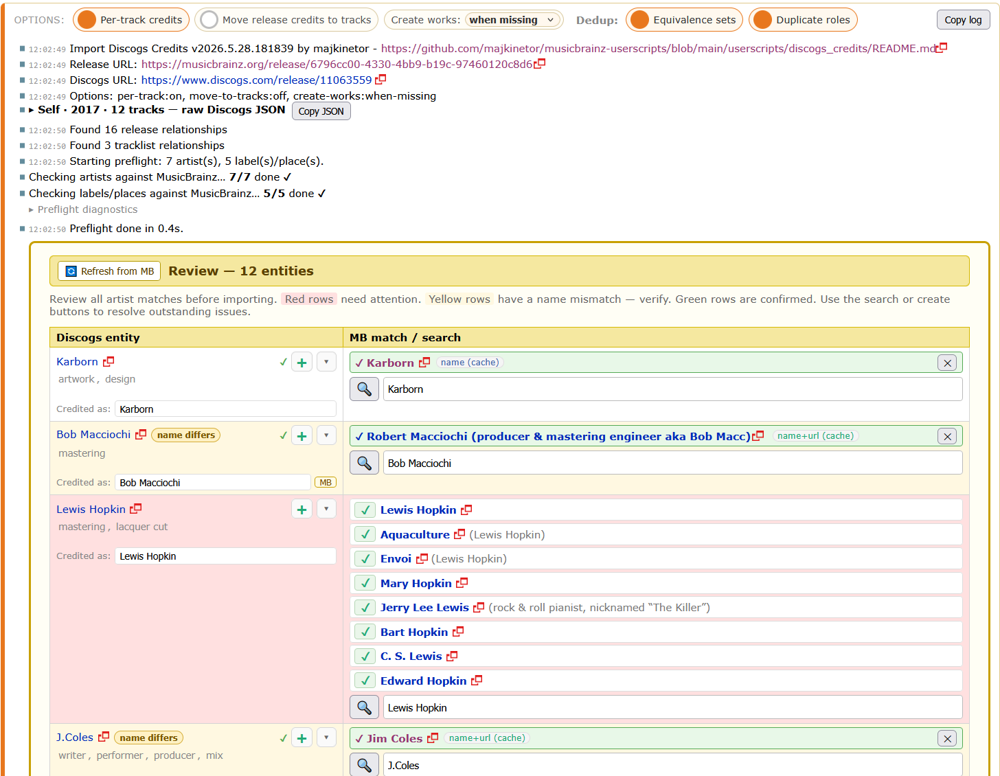

# Import Discogs Credits

Import Discogs credits as MusicBrainz release relationships.

- [Install from Greasy Fork](https://greasyfork.org/en/scripts/578977-musicbrainz-import-discogs-credits)
- [Install latest from GitHub](https://raw.githubusercontent.com/majkinetor/musicbrainz-userscripts/refs/heads/main/userscripts/discogs_credits/dist/discogs_credits.user.js)
- [Users](https://musicbrainz.org/search/edits?auto_edit_filter=&order=desc&negation=0&combinator=and&conditions.0.field=edit_note_content&conditions.0.operator=includes&conditions.0.args.0=Import+Discogs+Credits)

This userscript presents itself on *Edit relationships* screen of the MusicBrainz release for those releases having associated Discogs release link.

The workflow is as follows:

1. Script first gets all entities (artists, places, labels) and present them in the *Entity Review Table*.
    1. Each Discogs entity is matched by name and Discogs URL
    1. Perfect hits are automatically selected, while ambiguous or non existent entities are left for the user to resolve or ignore
1. After the data in the review table is confirmed, *Instant Fill* is initiated
    1. Entities that have their MB ID resolved will be associated to release or track depending on options, others are skipped but reported in log
    1. Some relationship are added to the work instead of the track. Non existent work can automatically be created depending on option. If the work doesn't exist, relationship will not be added and will be reported in log
1. At the end and after potential manual interventions, user confirms the edit

See also [animated gifs](#animated-gifs).

Make sure to read [Style / Relationships](https://musicbrainz.org/doc/Style/Relationships) for general guidelines.

Based on the userscripts of *mattgoldspink*, *vzell*, *kellnerd*.

## Features

### Import Bar

The UI strip at the top of the page with options, an Import button, log output, a 📖 Documentation link, and Copy-log buttons.

Options are saved in localStorage and persist across sessions.

1. **Per-track credits** 
Import track-level artist credits in addition to release-level credits. Captured at import-click — toggling it during the review phase logs a warning and the original value is used (preflight is conditional on this).
1. **Move release credits to tracks** 
Move appropriate release-level credits down to all recordings (instruments, vocals, producer, mix, etc.). Doesn't move any pre-existing release-level credits.
1. **Create works** — mode picker:
    - `when needed` (default) — create a work only when there's a composer/lyricist/writer credit to attach to the recording. Recordings without any such credit (or whose only such credit references an unresolved entity) are left alone.
    - `when missing` — create a work for every recording without one, regardless of credits.
1. **Dedup: Equivalence sets** 
Skip a role when an equivalent role already exists on the target (writer ≡ composer).
1. **Dedup: Duplicate roles** 
Skip adding a role when the target already has the same role (regardless of attributes / dates / tasks).

Options 2–5 are re-read at dispatch time, so they can be flipped during the review phase and the import will follow the latest pick.

The bar also includes:
- **Progress bar** that runs in marquee mode during indeterminate stages (Discogs fetch, MB rate-limit waits) and switches to determinate fill during preflight and dispatch.
- **Copy log** / **Copy log (no JSON)** for filing issue reports. Mid-review copies substitute the static markdown table for the interactive review panel.

### Entity Review Table

Single-row-per-entity table for confirming Discogs ↔ MusicBrainz matches before dispatch.

**Row state** is conveyed by color and badges:
- 🟢 confirmed (auto-resolved or user-selected)
- 🟡 name differs (resolved via URL but the MB name doesn't match Discogs — verify)
- 🔴 needs attention (not resolved)
- "no profile" red badge when the Discogs entity has no profile page

**Discogs URL link state** appears as a single chip per row:
- ✓ Discogs URL already linked
- 🔗 Add Discogs link (one click opens MB's edit page pre-filled; the chip flips to ✓ when the user returns to the tab after submitting)
- ⚠ linked to a different MB entity

- **Parallel lookup** 
All artists, labels and places are checked against MB through a shared throttle (4 concurrent in-flight requests + cooperative `Retry-After` backoff on 429/503). Preflight runs artists then companies sequentially to avoid bursting MB's rate limiter.
- **IDB cache** 
Resolved Discogs ↔ MB MBID mappings persist across sessions and are checked first. Each record tracks how it was originally resolved (`name` / `url` / `both` / `user`) — surfaced in the table's "Resolved via" column.
- **Inline MB search** 
Live search field on every row; type a name or paste an MBID / MB URL. Results appear as selectable candidates with a "Searching…" placeholder while MB responds (and a visible "Search failed" if it doesn't).
- **Auto-match** 
Name search and Discogs URL lookup run in parallel. Auto-resolution happens only when the result is trustworthy:
  - **Both agree** on the same MB entity → resolved with high confidence (`resolvedVia: 'both'`).
  - **Only one side** returns a hit → auto-accepted only when strong (unique exact-name match OR direct Discogs↔MB URL relation).
  - **They disagree** → left unresolved for manual review (prevents false positives from a wrongly-linked Discogs URL).
- **Entity creation** 
`+` button opens MB's create page pre-filled with name, sort-name guess, type ("Person" for artists), Discogs URL, and link-type ID. After save the new tab closes itself (capped at ~1s) and the row auto-selects the new entity via BroadcastChannel. The Discogs-link chip is pre-seeded to ✓ because the create form included the URL relation.
- **Refresh from MB** 
🔄 button re-resolves every entity against fresh MB data. Bypasses the IDB cache *and* deletes the existing record up-front, so a failed refresh leaves the entity un-cached (next preflight retries MB) rather than downgrading a previously-good MBID to "attention".
- **Credited as** 
Per-entity override input — set the `entity1_credit` field on every dispatched rel for that entity. Useful when Discogs and MB names differ but you want the Discogs name on the credit.
- **Preflight diagnostics** 
Collapsed `
` block below the main log with per-worker, per-request trace (start time, response code, retries, shared-pause events). Useful when something feels slow.

### Instant Fill

The dispatch-based zero-dialog import. Idempotent — skips relationships that already exist on the target or were dispatched earlier in the same session.

- Release-level: labels, places, company credits, release artists.
- Tracklist: instruments, vocals, task attributes.
- Work-level: lyrics, composer, writer (with work auto-creation per the chosen mode).
- Statistics in the edit note: input size, unresolved count, added / existed-in-MB / deduped-this-session / skipped / failed.

### Page-wide helpers

These run on every `/edit-relationships` page regardless of whether a Discogs link is present:

- **Hover-highlight** — Hovering an entity in the rel editor highlights all relationships that reference it (and vice versa). Also runs against the review table while it's open.
- **Batch-remove** — Modifier-click on any MB `×` button opens a popup to remove all relationships matching a chosen scope (by entity, by link type, by track range, only-this-session).

## Notes

1. **IndexedDB cache** 
`entity_cache` store; resolved Discogs URL → MB MBID mapping with `resolvedVia` source tracking and `urlLinkedIds` so the review table can render the Discogs-link chip without a per-row fetch.
1. **Rate-limit handling** 
All MB WS2 requests go through a single throttle. `MAX_CONCURRENT=4`. On 429/503 the worker that received the rate-limit pushes a shared `_pauseUntil` forward by the server's `Retry-After` (or exponential backoff if absent); every other worker idles until it elapses (cooperative backoff, no thundering herd). Per-request 10s `AbortController` timeout prevents stuck connections from blocking a slot; network-layer timeouts are treated as cooperative backpressure too.
1. **Hover-intent tooltips** 
The custom toggle tooltips wait ~1s before showing, matching the browser's native `title=` delay, so sweeping the mouse across the option row doesn't fire a stack of tooltips.
1. **unsafeWindow** 
Uses `@grant unsafeWindow` to access MB's real page `window` (where `MB.relationshipEditor` lives) from the userscript sandbox.
1. **BroadcastChannel** 
Same-origin cross-tab messaging for the entity-creation → review-table feedback loop.
1. **Discogs API** 
Fetches release data (artists, companies, tracklist) from `api.discogs.com` using the token from MB's stored Discogs URL.

## Animated gifs

For [Funk D’Void - Technoir](https://musicbrainz.org/release/63b2e0e6-5857-43cf-be6b-c98397f5d817), just one work exists, everything else is added by the import script

For [Mocky - Music Will Explain (Choir Music Vol. 01)](https://musicbrainz.org/release/3e5946b6-d275-4664-a8e9-1b15f0c55d68), many credits are already in place. Script skips those already created and adds those that do not exist. No works are created because existing ones are found. Existing release level credits that would be added to recordings by the script if they didn't exist, are not removed.

## Development

See [DEVELOP.md](./DEVELOP.md) for prerequisites, install steps, the dev loop, testing, and contributor workflow.
