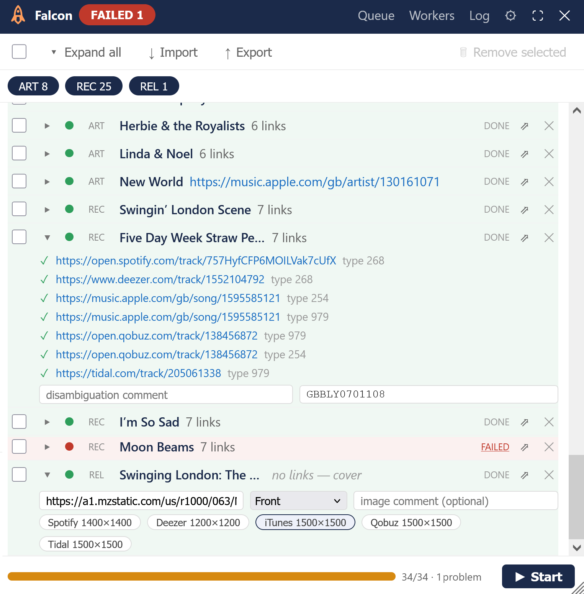
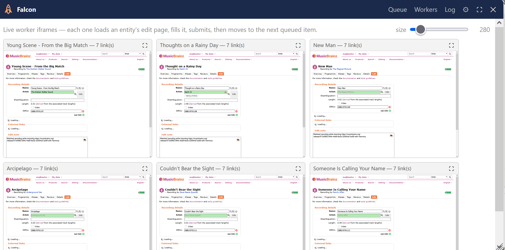
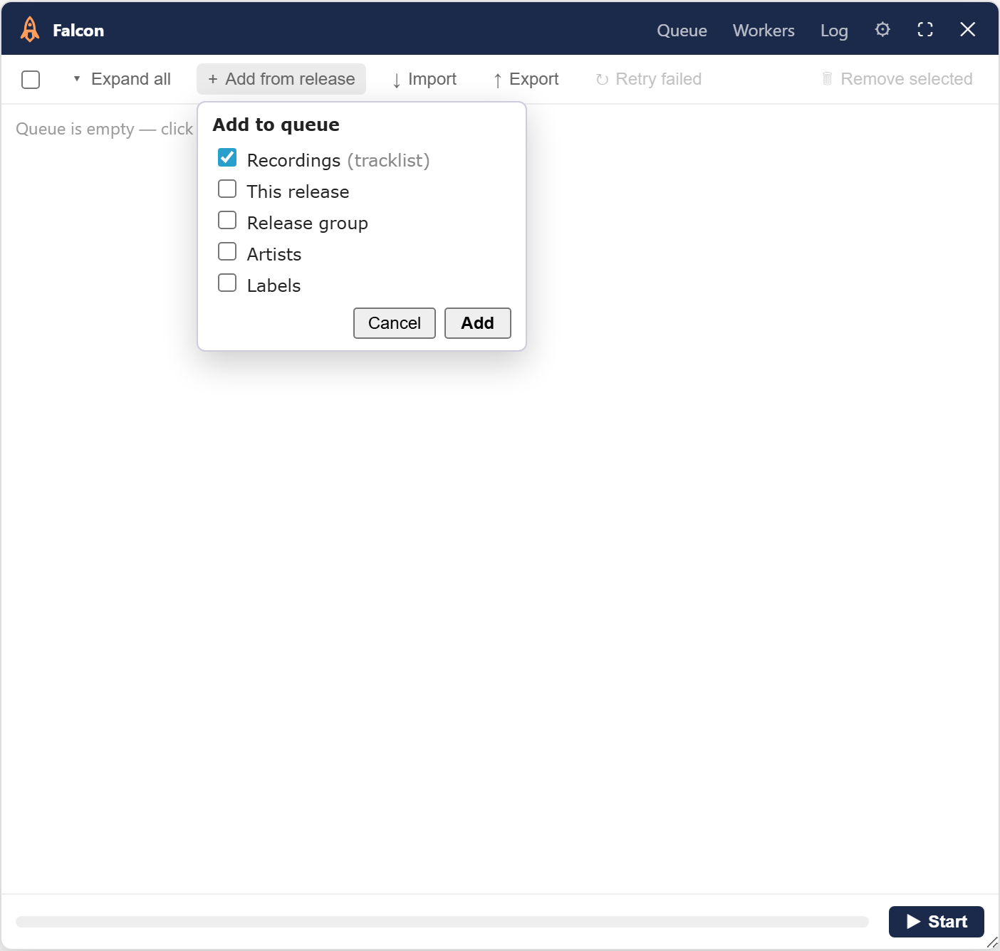
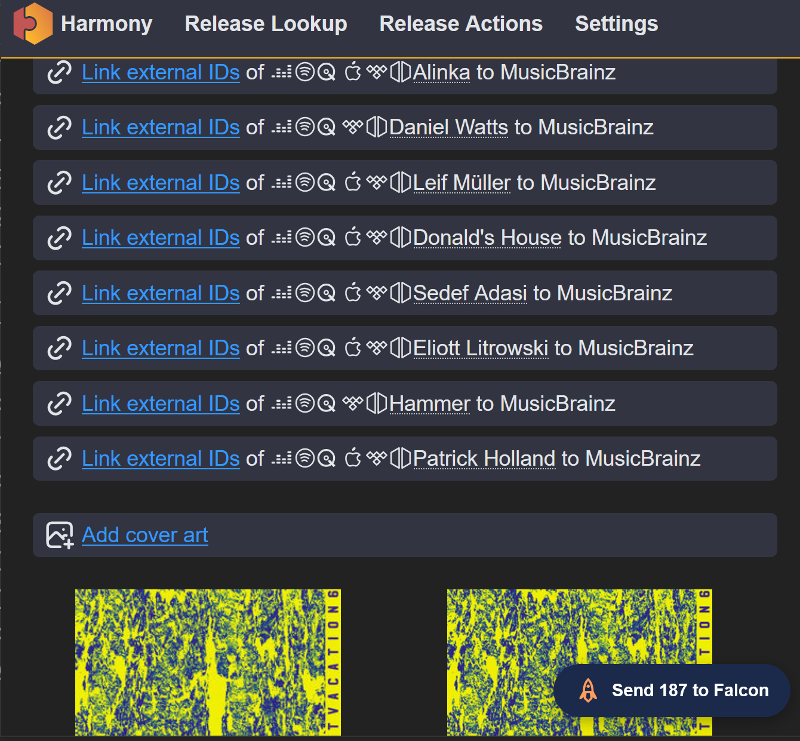

# Falcon 

**Falcon** is a MusicBrainz batch editor that uses a pool of iframe workers to add entity fields. Workers drive web forms or use an API, depending on what's available.

- Install: [stable](https://raw.githubusercontent.com/majkinetor/musicbrainz-userscripts/refs/heads/stable/userscripts/falcon/falcon.user.js) or [latest](https://raw.githubusercontent.com/majkinetor/musicbrainz-userscripts/refs/heads/main/userscripts/falcon/falcon.user.js)
- [Changelog](./CHANGELOG.md)
- [View users](https://musicbrainz.org/search/edits?auto_edit_filter=&order=desc&negation=0&combinator=and&conditions.1.field=edit_note_content&conditions.1.operator=includes&conditions.1.args.0=Falcon)



Adding data in automated way has no good options today. For example, an importer like [Harmony] hands you 20-50 artists/records/labels that each need an exeternal link and other data like isrcs and covers. MusicBrainz has no write API for some attributes so external tools can only open tabs that users are expected to individually handle.

Falcon provides unified interface to bulk edit supported entity [attributes](#attributes), regardless if it is done via API or form manipulation.  

## Usage

1. Populate a queue from [Harmony](#from-harmony), [the release you are on](#from-the-current-release), or import a [JSON file](#json-model) by accessing Falcon on any Musicbrainz page (CTRL+ALT+F).
2. Review the queue (remove some entities or edit attributes), then press Start button to process it.
   - Right-click a row's entity-type column to select every item of that same type at once so you can remove them
   - Or, click the chips in the header (`art`/`lbl`/`rec`/`rel`/`rg`) to exclude all instances of specific entity without removing them from queue 

Each queue row shows the entity's name, a [status](#statuses) dot, and, on failure, MB's own real error message on hover (e.g. *"This URL is not allowed for artists."*).

If a run leaves problems behind, a colored **FAILED**/**PARTIAL**/**MANUAL** chip appears at the very top, next to the Falcon name — click it to show just those rows; click again (or a different chip) to change the filter.

A worker whose item doesn't cleanly commit (e.g. a duplicate/rejected url etc.) retires that card in place — dimmed but still live and inspectable (nothing is discarded) — while a fresh worker card takes over the rest of the queue. A worker that *does* commit keeps flowing through the queue on the same card, building a fresh iframe for each new item rather than re-navigating a used one. Switch to the **Workers** tab to watch the live iframes — click a worker's **⛶** to view just that one large (useful for reading a validation error). 



> [!NOTE] 
> Click a red **FAILED**/**PARTIAL** status label to jump straight to that item's real worker in the **Workers** tab — the exact live page it left off on with the error shown as a banner right on the card.

Row button **⇗** opens that entity's edit page in a real tab, pre-filled the same way a worker would — but left for you to review and click "Enter edit" yourself. This is useful for retrying something the worker couldn't commit automatically. 

**Export** writes the queue back out *with each item's status and per-url outcome*, so a partly-finished run can be kept as a record, or re-imported to retry only what failed — items that already show `done` are not re-run.

**Retry failed** re-queues every `failed`/`partial` item for another attempt in place — no export/import round trip needed. Useful when the cause was transient (MusicBrainz being slow, a timeout) rather than the item genuinely being broken.

### From the current release

Open Falcon on a **release** (or **release-group**) page and the toolbar offers **+ Add from release** — it fills the queue with that release's own entities so you can edit them in bulk:

| | |
|---|---|
| **Recordings** | every track's recording, from the tracklist (ticked by default) |
| **This release** | the release itself |
| **Release group** | its release group |
| **Artists** | the release artist plus every track artist |
| **Labels** | the labels on the release |

On a **release-group** page the same button reads **+ Add from group** and offers the group itself (ticked by default) plus **Releases** — every release in the group, named, in one go.



Rows arrive **empty** — this seeds a worksheet, not a batch of edits. Fill in the fields you want on the rows you care about (**disambiguation** on any type that has one and **ISRCs** on recordings, urls on any type — see [Attributes](#attributes)), then press Start.

A release takes a different route to the same place. The other four edit pages are plain forms, so the comment travels in the seed url; the release editor is an app that ignores seeded parameters, so Falcon types the value into the field instead and lets the editor build the edit. Nothing to do differently as a user — it is just slower, and it needs the editor to finish loading, so a release row spends a few extra seconds on the page.

One thing to expect on disambiguation: MusicBrainz applies an *added* comment straight away,
but a *changed* one (replacing an existing comment) is queued as a normal edit for a vote.
Falcon reports both as done — the edit was submitted either way; the second kind just won't
be visible on the entity until it passes.

Rows you never touched are **skipped**, not failed: an item with no url, disambiguation, ISRC or cover has nothing to submit, so Falcon leaves it alone and says so. That means you can add a whole tracklist, fill in two rows, and run it without a screenful of failures.

It also works as a way to *produce* a JSON worksheet: add the entities, press **Export**, fill the file in at your leisure, then **Import** it back and Start.

> [!TIP]
> Names come from the same request that fetches the tracklist, so rows are labelled immediately without a lookup per entity, and an entity appearing on several tracks is added once.

### From Harmony

Open a [Harmony] **Release Actions** page and a **"Send N to Falcon"** button appears in the bottom-right corner, covering every entity type Harmony offers. Clicking the button opens MusicBrainz in a new tab with the batch queued and the panel open, ready to review and Start.



Harmony integration fills Falcon queue with external links for all entities, recording isrcs and cover.

#### Cover art

When a Harmony Release Actions page has cover art (front image, one per provider — Discogs is skipped), the batch includes a queue item for the release itself, showing *cover* in its row summary. Falcon picks the best candidate automatically — highest resolution, then lowest size — measuring each one itself when Harmony's own page doesn't already say so. Expand the row to see (and override) the picked URL, set its **type** (Front, Back, Booklet, …), add a **comment** for that specific image, or swap between providers if more than one was found; Falcon accepts a URL for the image only (no file upload).

Falcon currently adds front cover art from Harmony, although it generally supports a list (which can be hand-written [JSON](#json-model)).

A cover-art item is added via API (sign → upload → register), the same one [Art Station](../art_station) uses.

> [!WARNING] 
> Harmony offers cover art whether or not the release already has some — adding one isn't idempotent the way links are. Falcon checks the Cover Art Archive as soon as a release item is queued and, if it already has cover art, the warning is shown.

## How it works

Since MusicBrainz sends no `X-Frame-Options` / CSP `frame-ancestors`, its edit pages can be framed — so Falcon's panel hosts a handful of same-origin `<iframe>` workers instead. Same-origin means the panel's own script can reach directly into each iframe's DOM — check the form, submit, and once MB redirects off `/edit`, load the next queued entity into a fresh iframe on that same worker. The worker count never grows with the queue size, and nothing opens or closes per item.

Each worker navigates to MusicBrainz's own **seed URL** format (`?edit-<type>.url.0.text=…&…link_type_id=…`), so MB fills the form itself as the page renders instead of Falcon simulating typing into it. Falcon only touches the form for what seeding can't express: applying a relationship type MB left unresolved, adding a second relationship type on a url that needs two, and clearing rows MB couldn't classify (which would otherwise disable the submit button for the entire group).

If API is available, Falcon uses it rather then driving a form. 

## Statuses

|Status|Meaning|
|---|---|
|queued|Entity is not yet processed|
|in-progress|Entity is beeing acivelly processed|
|done|Processing is finished without errors|
|partial|Some array data is added, other failed|
|failed|Completelly failed
|manual|User has manually added data for the entity|
|skipped|Nothing to submit — either MusicBrainz reported no change, or the row has no url/disambiguation/ISRC/cover filled in yet (see [From the current release](#from-the-current-release))|
|excluded|Excluded by disabling entity chip at the header|

## Attributes 

Field usage by entity type

| field | artist | label | recording | release | release group |
| --- | --- | --- | --- | --- | --- |
| External links | yes | yes | yes | yes | yes |
| ISRC | — | — | yes | — | — |
| Disambiguation | yes | yes | yes | yes | yes |
| Cover art | — | — | — | yes| — |

## JSON model

Falcon has basic entity forms — the file is loaded by **Import**, written by **Export**, and used internally is the actual interface for batch loading; Harmony and `?falcon=` are just producers of this same shape. Root is either a bare array of items or `{"items": [...]}`:

```json
{
  "falcon": "2026.8.14",
  "exported": "2026-08-14T10:00:00.000Z",
  "items": [
    {
      "entityType": "artist",
      "mbid": "d31f76d2-1d8e-4271-8027-148f375979d7",
      "name": "Der Zirkel",
      "note": "via Falcon",
      "urls": [{ "url": "https://myspace.com/x", "linkTypeId": null }],
      "status": "done",
      "error": "",
      "urlResults": null
    },
    {
      "entityType": "recording",
      "mbid": "e42f8e08-3150-4c6c-be5b-4030c29b1bf7",
      "urls": [],
      "disambiguation": "live version",
      "isrcs": ["NLTH62000001"]
    },
    {
      "entityType": "release",
      "mbid": "8ad416ad-f3a1-43bb-9e85-786efefd5173",
      "urls": [{ "url": "https://www.discogs.com/release/1", "linkTypeId": "75" }],
      "cover": [{ "url": "https://e-cdns-images.dzcdn.net/images/cover/x/1000x1000.jpg", "comment": "page 1", "type": "Booklet", "candidates": [] }]
    }
  ]
}
```

| attribute | type | meaning |
| --- | --- | --- |
| `entityType` | string | one of `artist`, `label`, `recording`, `release`, `release_group` |
| `mbid` | string | the entity's MBID |
| `urls[]` | array of `{url, linkTypeId}` | external links to add — every entity type; `linkTypeId` optional (MB auto-classifies if omitted) |
| `note` | string | edit note |
| `disambiguation` | string | MB's own disambiguation comment field — every entity type has one. For a release it is the **Disambiguation** box under *Additional information* in the release editor |
| `isrcs[]` | array of string | recording-only |
| `cover[]` | array of `{url, comment, type, candidates}` | release-only — the cover art to upload. An **array**: a release can carry more than one cover image, though Falcon today only ever populates one entry from Harmony. Each entry's own `comment` is that image's upload comment (unrelated to `disambiguation`); `type` is MB's cover-art type (`Front`, `Back`, `Booklet`, `Medium`, …, default `Front`); `candidates` are not-yet-measured alternates Falcon is still picking a winner from |
| `name` | string or null | display name — re-fetched if omitted, so it's optional |
| `status` | string | item processing [status](#statuses) |
| `error` | string | last error message, if any |
| `urlResults` | array or null | per-url ✓/✗ outcome from the last run, shown on hover in the expanded row |

The `?falcon=` URL parameter ([From another script](#from-another-script)) uses a lighter, flattened subset of this same model — one row per url instead of a grouped `urls[]` — meant for a single script call rather than a saved file.

### From another script

Any other script can hand Falcon a queue directly via a URL parameter: append `?falcon=<base64(JSON)>` to any `musicbrainz.org` URL. Falcon detects the param on load, seeds the queue, and opens the panel automatically (does not auto-start). 

### Options

Click the ⚙ tab to open it.

1. **Hide Falcon icon** - the floating corner launcher becomes optional; **Ctrl+Alt+F** still opens the panel either way
2. **Add covers only when there aren't any** - skip a release's cover upload instead of adding it blind when the release already has cover art
3. **Auto start Harmony import** (off by default) - start processing the queue immediately after "Send to Falcon" from Harmony, instead of waiting for a manual **Start**
4. **Open from Harmony in new tab** (on by default) - off navigates the current Harmony tab to MusicBrainz instead of opening a new one
5. **Workers** - how many entities are processed at once (default is 5)
6. **Keep last N run logs** (default 20) - how many past runs' logs stick around, selectable from the Log tab's history dropdown

### Reporting a problem

The **Log** tab traces every worker step — which entity it loaded, how each url was resolved (already present / seeded and classified / typed / rejected and why), whether the submit button was reachable, and how long each stage took. Lines are tagged per worker (`[w1]`, `[w2]`…) since workers run concurrently. Leave the **debug** checkbox on, reproduce the problem, then hit **Copy log** and paste it into the issue — that's usually enough to pinpoint a worker that stopped short of submitting without needing a live reproduction.

Each run gets its own log, kept separately so one run's lines never get mixed into another's. The dropdown next to **debug** lists past runs by date/time — pick one to review or copy it instead of the current session. **Clear history**, next to that dropdown, deletes every past run's log in one go (the current session's log is untouched — use the **Clear** button for that).

## Shortcuts

| Shortcut | Action |
| --- | --- |
| **Ctrl+Alt+F** | Open / close the Falcon panel |

## Note

Entity names resolve through the same rate-limit-aware throttle MB API calls use elsewhere in these scripts (a handful concurrently, cooperatively backing off on an actual 429/503 via its Retry-After header) — fast for a normal batch, but still polite to MB's webservice under a big one. They also **yield to a run**: pressing Start drops any lookups still pending, because they are cosmetic while the workers' edit-page loads are not, and both draw on the same per-IP rate limit. Rows keep whatever label they have until the run finishes, then resolution resumes.

A url that MB considers ambiguous (a Bandcamp track is the common case — could be "purchase for download", "streaming", etc.) needs an explicit relationship type MusicBrainz can't infer on its own; without one, Falcon reports that specific url as failed with a clear reason rather than letting it silently block the rest of its group's submission. Use **⇗** to open it in a tab and pick the type by hand.

[Harmony]: https://harmony.pulsewidth.org.uk

