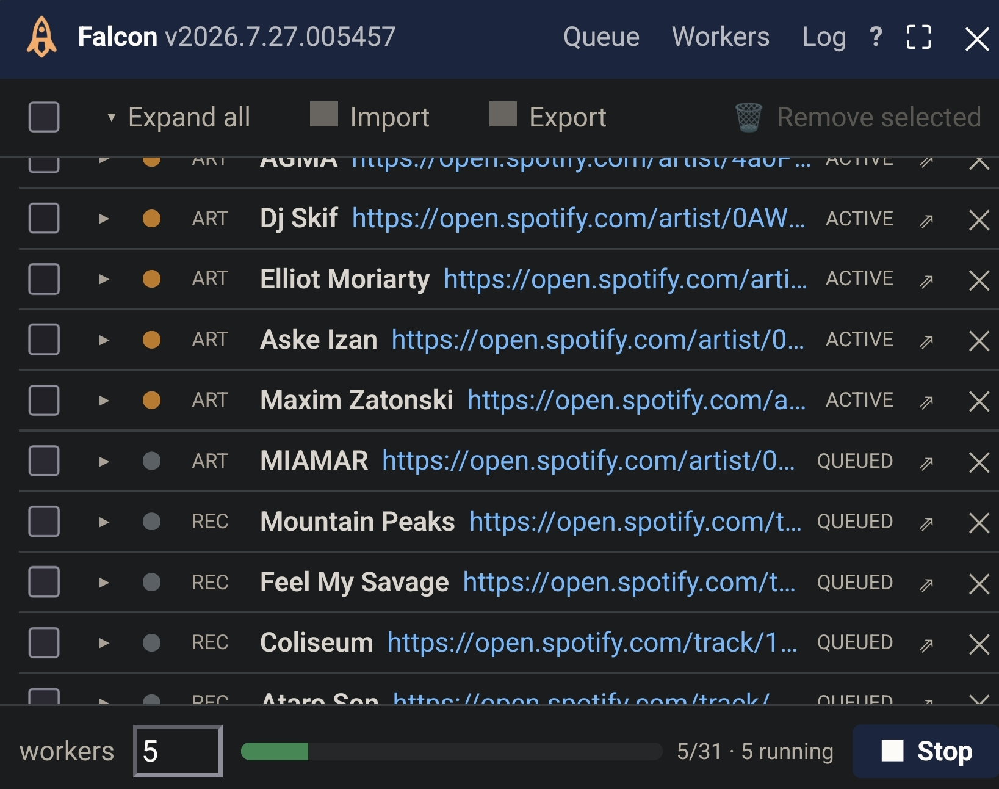
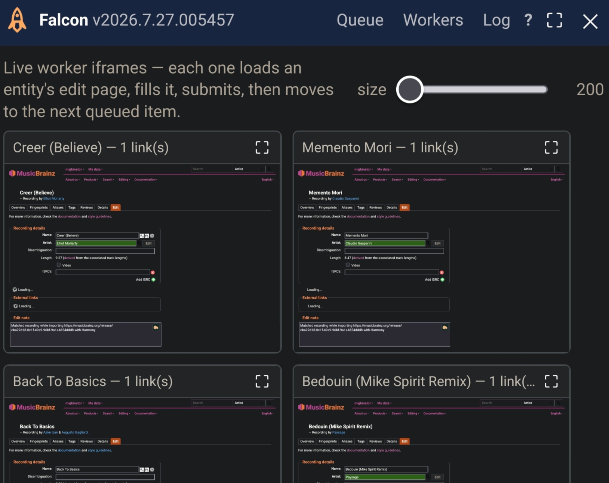

# Falcon 

**Falcon** adds external links and other fields to a *batch* of MusicBrainz entities at once — no popup-per-entity, no tab churn. A small pool of persistent worker iframes churns through a queue, each submitting its own edit and moving straight to the next entity.

- Install: [stable](https://raw.githubusercontent.com/majkinetor/musicbrainz-userscripts/refs/heads/stable/userscripts/falcon/falcon.user.js) or [latest](https://raw.githubusercontent.com/majkinetor/musicbrainz-userscripts/refs/heads/main/userscripts/falcon/falcon.user.js)
- [Changelog](./CHANGELOG.md)
- [View users](https://musicbrainz.org/search/edits?auto_edit_filter=&order=desc&negation=0&combinator=and&conditions.1.field=edit_note_content&conditions.1.operator=includes&conditions.1.args.0=Falcon)

| Queue | Workers |
| --- | --- |
| [](./screenshots/queue.jpg) | [](./screenshots/workers.jpg) |
| A run in progress: 31 entities, 5 workers, mixed artists and recordings. Each row shows the resolved entity name, its status, and its link. | The **Workers** tab — the live iframes doing the work, sized by the slider. Each is a real MusicBrainz edit page being filled and submitted. |

The following fields are currently supported:

- External links: artists, labels, recordings, releases, release groups
- ISRC
- Disambiguation: recordings
- Cover art: releases

## Field usage by entity type

| field | artist | label | recording | release | release group |
| --- | --- | --- | --- | --- | --- |
| External links | yes | yes | yes | yes | yes |
| ISRC | — | — | yes | — | — |
| Disambiguation | — | — | yes | — | — |
| Cover art | — | — | — | yes (array — see [below](#release-cover-art)) | — |

A release item can carry external links *and* cover art at once — two independent MusicBrainz edits on the same entity, run one after the other regardless of how the other one goes (a rejected link doesn't block the cover upload, and vice versa; the row ends up **partial** if only one of the two went through).

## JSON model

Falcon has no per-entity form — the file loaded by **Import**, written by **Export**, and used internally is the actual interface for batch loading; Harmony and `?falcon=` are just producers of this same shape. Root is either a bare array of items or `{"items": [...]}` (Export writes the latter, with `falcon`/`exported` metadata alongside):

```json
{
  "falcon": "2026.8.14",
  "exported": "2026-08-14T10:00:00.000Z",
  "items": [
    {
      "entityType": "artist",
      "mbid": "d31f76d2-1d8e-4271-8027-148f375979d7",
      "name": "Der Zirkel",
      "note": "via Falcon",
      "urls": [{ "url": "https://myspace.com/x", "linkTypeId": null }],
      "status": "done",
      "error": "",
      "urlResults": null
    },
    {
      "entityType": "recording",
      "mbid": "e42f8e08-3150-4c6c-be5b-4030c29b1bf7",
      "urls": [],
      "disambiguation": "live version",
      "isrcs": ["NLTH62000001"],
      "status": "queued"
    },
    {
      "entityType": "release",
      "mbid": "8ad416ad-f3a1-43bb-9e85-786efefd5173",
      "urls": [{ "url": "https://www.discogs.com/release/1", "linkTypeId": "75" }],
      "cover": [{ "url": "https://e-cdns-images.dzcdn.net/images/cover/x/1000x1000.jpg", "comment": "page 1", "type": "Booklet", "candidates": [] }],
      "status": "queued"
    }
  ]
}
```

| field | type | meaning |
| --- | --- | --- |
| `entityType` | string | one of `artist`, `label`, `recording`, `release`, `release_group` |
| `mbid` | string | the entity's MBID |
| `urls[]` | array of `{url, linkTypeId}` | external links to add — every entity type; `linkTypeId` optional (MB auto-classifies if omitted) |
| `note` | string | edit note |
| `disambiguation` | string | recording-only — MB's own disambiguation comment field |
| `isrcs[]` | array of string | recording-only |
| `cover[]` | array of `{url, comment, type, candidates}` | release-only — the cover art to upload. An **array**: a release can carry more than one cover image, though Falcon today only ever populates one entry from Harmony. Each entry's own `comment` is that image's upload comment (unrelated to `disambiguation`); `type` is MB's cover-art type (`Front`, `Back`, `Booklet`, `Medium`, …, default `Front`); `candidates` are not-yet-measured alternates Falcon is still picking a winner from |
| `name` | string or null | display name — re-fetched if omitted, so it's optional |
| `status` | string | `queued` (default if omitted/unrecognized) / `active` / `done` / `partial` / `failed` / `manual` / `skipped` — re-importing an Export lets you keep or retry each item |
| `error` | string | last error message, if any |
| `urlResults` | array or null | per-url ✓/✗ outcome from the last run, shown on hover in the expanded row |

A minimal add-only item just needs `entityType`, `mbid`, and `urls[]` — or, for a recording, `disambiguation`/`isrcs[]` in place of `urls[]` (see [Recording disambiguation and ISRC](#recording-disambiguation-and-isrc)) — every other field defaults sanely. This is also exactly what a re-imported Export round-trips through unchanged. (A pre-#496 export's `comment` field — on either a recording or a release — is still accepted on import and mapped onto `disambiguation`/`cover[0].comment` respectively, so older saved files keep working.)

The `?falcon=` URL parameter ([From another script](#from-another-script)) uses a lighter, flattened subset of this same model — one row per url instead of a grouped `urls[]` — meant for a single script call rather than a saved file.

## Why

Bulk-linking a batch of artists (the recurring case: an importer like Harmony hands you 20-50 artists that each need a Bandcamp/Discogs/etc. link) has no good options today — MusicBrainz has no write API for relationships (`/ws/2/` only supports tags/ratings/ISRCs/collections), so every tool has to drive the real edit page. The obvious approach — a tab per artist — is what Harmony already does, and it's bad UX: a popup storm you then have to close by hand (or via a "submit all open tabs" helper).

Falcon avoids tabs entirely. Since MusicBrainz sends no `X-Frame-Options` / CSP `frame-ancestors`, its edit pages can be framed — so Falcon's panel hosts a handful of same-origin `<iframe>` workers instead. Same-origin means the panel's own script can reach directly into each iframe's DOM — check the form, submit, and once MB redirects off `/edit`, load the next queued entity into a fresh iframe on that same worker. The worker count never grows with the queue size, and nothing opens or closes per item.

Each worker navigates to MusicBrainz's own **seed URL** format (`?edit-<type>.url.0.text=…&…link_type_id=…`), so MB fills the form itself as the page renders instead of Falcon simulating typing into it. Falcon only touches the form for what seeding can't express: applying a relationship type MB left unresolved, adding a second relationship type on a url that needs two, and clearing rows MB couldn't classify (which would otherwise disable the submit button for the entire group).

## Usage

Populate a queue via [Harmony](https://harmony.pulsewidth.org.uk) or by importing a JSON, then execute it. Each worker generally takes between 1 and 2 seconds per queue entity.

1. Click the small rocket button in the bottom-right corner of any MusicBrainz page (or press **Ctrl+Alt+F**) to open the panel, which opens centered on screen (drag its header to move it).
2. Click **Import** to load a queue from a JSON file. A queue can also arrive from a `?falcon=` URL or the [Harmony button](#from-harmony), which is the usual route. **Export** writes the queue back out *with each item's status and per-url outcome*, so a partly-finished run can be kept as a record, or re-imported to retry only what failed — items that already show `done` are not re-run.
3. The queue list is the main part of the panel — each row shows the entity's real name, a status dot (queued/in-progress/done/partial/failed/manual), and, on failure, MB's own real error message on hover (e.g. *"This URL is not allowed for artists."*, *"This relationship already exists."* — scraped from the page, not guessed). Click the **▸** to expand a row and see every url in that entity's group individually, each with its own ✓/✗ once processed — or use the **Expand all** / **Collapse all** toggle in the toolbar to do every row at once.
4. Each row also has **⇗** (open this entity's edit page in a real tab, pre-filled the same way a worker would — but left for you to review and click "Enter edit" yourself; useful for retrying something the queue couldn't commit automatically) and **✕** (remove from the queue). Check the **all** box or several rows individually and use **Remove selected** to drop a whole group at once. Right-click a row's entity-type column (`art`/`lbl`/`rec`/`rel`/`rg`) to select every item of that same type at once.
5. A chip per entity type sits above the queue (`ARTIST 5`, `RELEASE 7`, ...) once the queue has more than one type in it — all ON by default. Click one off to exclude every still-queued item of that type from the next run without removing them from the queue; they stay visible, dimmed, and marked **excluded**. Toggle it back on to include them again.
6. Click a red **FAILED**/**PARTIAL** status label to jump straight to that item's real worker in the **Workers** tab — the exact live page it left off on (not a fresh reload), zoomed large, with the error shown as a banner right on the card. Falls back to a plain text popup only for an item no worker ever picked up.
7. Set how many workers to run at once at the bottom, then **▶ Start**. The default is 5, which measured fastest on a real batch (~1.8s per item, against ~2.3s at 3); the gain flattens above that, so the cap is 6. Switch to the **Workers** tab to watch the live iframes — click a worker's **⛶** to view just that one large (useful for reading a validation error). The panel itself has a **⛶** maximize toggle in the header too.
8. A worker whose item doesn't cleanly commit (e.g. a duplicate/rejected url) retires that card in place — dimmed but still live and inspectable (nothing is discarded) — while a fresh worker card takes over the rest of the queue. A worker that *does* commit keeps flowing through the queue on the same card, building a fresh iframe for each new item rather than re-navigating a used one.

Entity names resolve through the same rate-limit-aware throttle MB API calls use elsewhere in these scripts (a handful concurrently, cooperatively backing off on an actual 429/503 via its Retry-After header) — fast for a normal batch, but still polite to MB's webservice under a big one. They also **yield to a run**: pressing Start drops any lookups still pending, because they are cosmetic while the workers' edit-page loads are not, and both draw on the same per-IP rate limit. Rows keep whatever label they have until the run finishes, then resolution resumes.

A url that MB considers ambiguous (a Bandcamp track is the common case — could be "purchase for download", "streaming", etc.) needs an explicit relationship type MusicBrainz can't infer on its own; without one, Falcon reports that specific url as failed with a clear reason rather than letting it silently block the rest of its group's submission. Use **⇗** to open it in a tab and pick the type by hand.

### From Harmony

Open a Harmony **Release Actions** page and a **"Send N to Falcon"** button appears in the bottom-right corner, covering every entity type Harmony offers — artists, labels, *and* recordings. Clicking the button opens MusicBrainz in a new tab with the batch queued and the panel open, ready to review and Start. If the page also has an **"Open with MagicISRC"** action, Falcon reads the ISRCs off it and attaches each one to its matching recording (by track position) — one queue instead of a separate MagicISRC tab.

The whole batch travels via a short random token backed by the userscript's own storage rather than a `?falcon=` payload in the URL — that avoids the URL-length ceiling a large batch used to hit.

If Harmony's own URL carries the release's mbid (`?...&release_mbid=<mbid>` — present right after adding a release from Harmony), the button opens the panel on that release's own page instead of MusicBrainz's homepage — not its relationship editor, since provider links Harmony doesn't cover, tagging, and adding to a collection all happen from the release page itself.

### Recording disambiguation and ISRC

A recording queue item can also carry a **disambiguation comment** and one or more **ISRCs** — expand its row to fill them in directly (no computation, no lookup: whatever's typed there is seeded verbatim, same as a url). Both ride along with that recording's own edit — nothing else is submitted for them separately.

### Release cover art

When a Harmony Release Actions page has cover art (front image, one per provider — Discogs is skipped), the batch includes one extra queue item for the release itself, showing "cover" in its row summary. Falcon picks the best candidate automatically — highest resolution, then lowest size — measuring each one itself when Harmony's own page doesn't already say so. Expand the row to see (and override) the picked URL, set its **type** (Front, Back, Booklet, …), add a **comment** for that specific image, or swap between providers if more than one was found; Falcon accepts a URL for the image only (no file upload).

A release's cover art is a list (`cover[]` in the [JSON model](#json-model)) — Falcon only ever populates one entry from Harmony today, but the UI renders one row per entry, so an item carrying several (e.g. hand-written in an imported JSON) shows and uploads all of them, each with its own type/comment.

Unlike every other entity type, a cover-art item isn't submitted through MusicBrainz's edit-relationships form at all — there isn't one for cover art. Falcon drives MB's own upload API directly (sign → upload → register), the same one [Art Station](../art_station) uses.

Harmony offers cover art whether or not the release already has some — adding one isn't idempotent the way links are. Falcon checks the Cover Art Archive as soon as a release item is queued and, if it already has cover art, marks the row with a ⚠ ("cover ⚠" in the collapsed summary, hover for the count; the full warning in the expanded row) rather than uploading blind.

### From another script

Any other script can hand Falcon a queue directly via a URL parameter: append `?falcon=<base64(JSON)>` to any `musicbrainz.org` URL, where the JSON is an array of `{ "entityType": "artist" | "label" | "recording" | "release" | "release_group", "mbid": "...", "url": "...", "linkTypeId"?: "...", "note"?: "...", "isrc"?: "..." }` (`linkTypeId` is optional — when present it's used to set MB's relationship-type dropdown if one is shown; otherwise MB auto-classifies as usual; `isrc`, recording-only, is added alongside the url). Note `entityType` is `release_group` (underscore) even though MusicBrainz's own URL for that entity uses a hyphen (`/release-group/<mbid>`) — Falcon maps between the two internally. Falcon detects the param on load, seeds the queue, and opens the panel automatically (does not auto-start — review, then click Start). (The GM-storage-token scheme Harmony uses above only works between Falcon's own two ends, since userscript storage isn't shared across different scripts — the base64 form is the contract for everyone else.)

### Reporting a problem

The **Log** tab traces every worker step — which entity it loaded, how each url was resolved (already present / seeded and classified / typed / rejected and why), whether the submit button was reachable, and how long each stage took. Lines are tagged per worker (`[w1]`, `[w2]`…) since workers run concurrently. Leave the **debug** checkbox on, reproduce the problem, then hit **Copy log** and paste it into the issue — that's usually enough to pinpoint a worker that stopped short of submitting without needing a live reproduction.

## Shortcuts

| Shortcut | Action |
| --- | --- |
| **Ctrl+Alt+F** | Open / close the Falcon panel |
