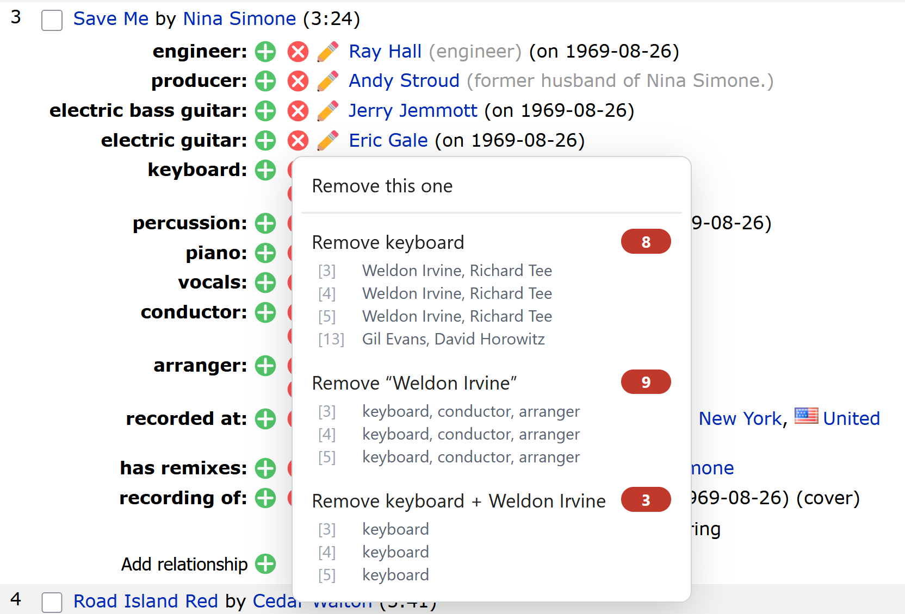
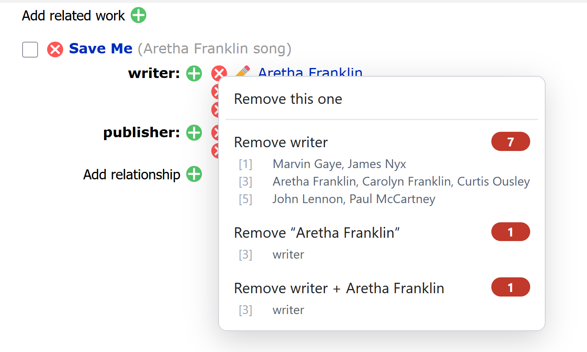
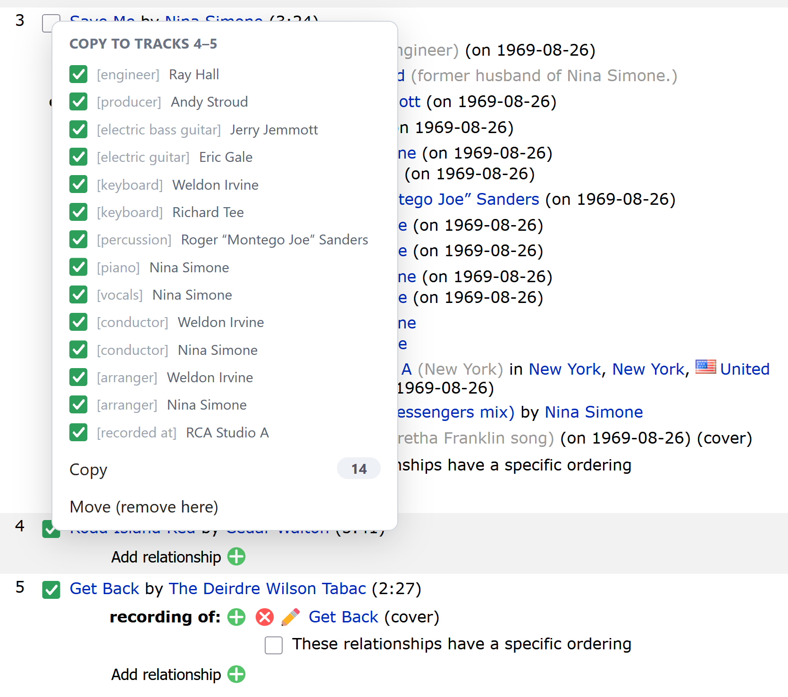
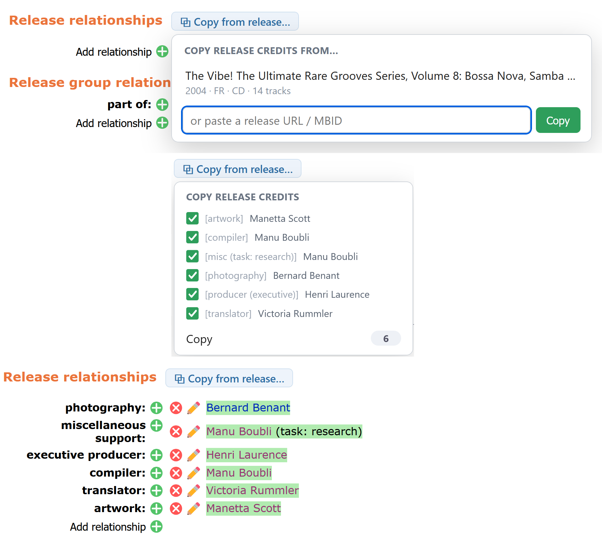
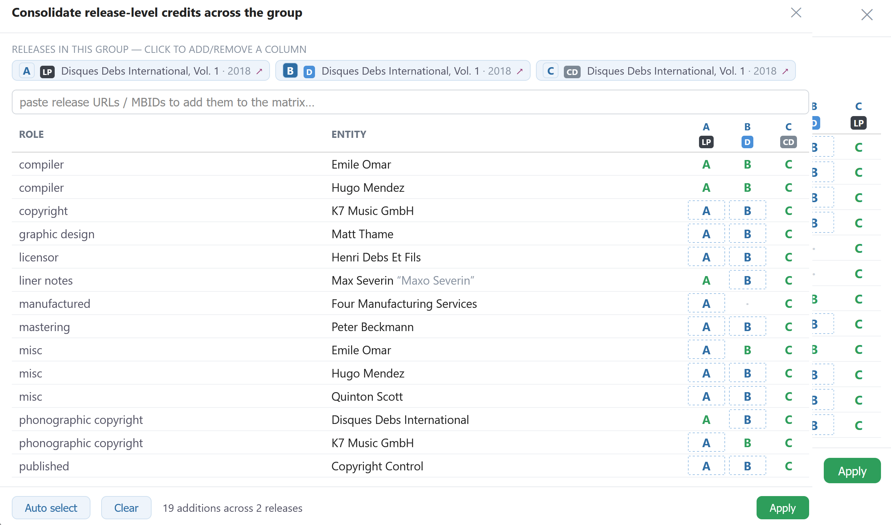
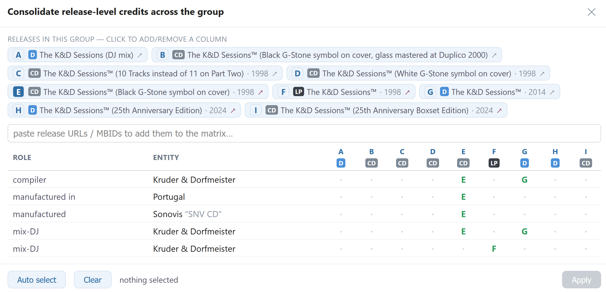
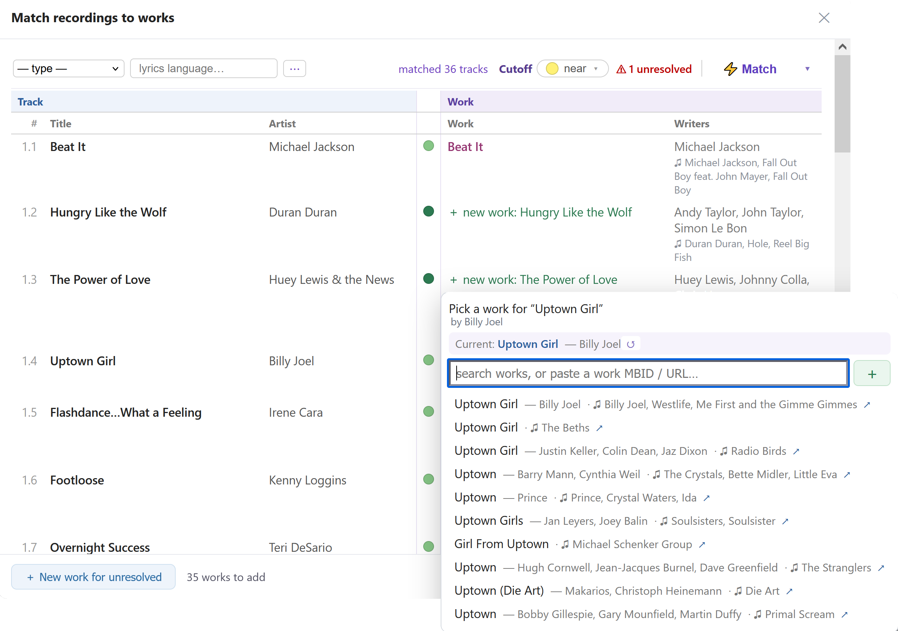
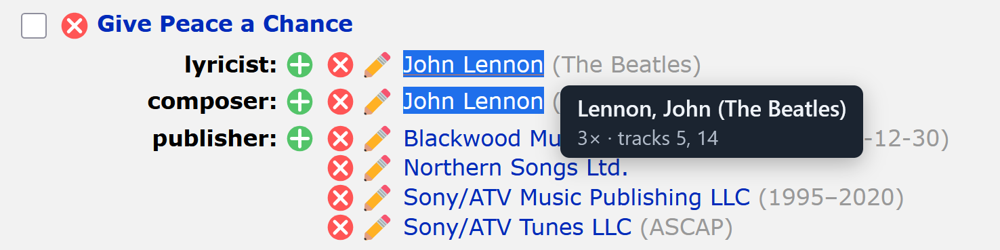
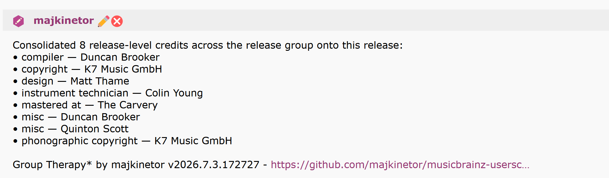

# Group Therapy 

Batch operations and various helpers on the MusicBrainz *Edit relationships* page.

- Install: [stable](https://raw.githubusercontent.com/majkinetor/musicbrainz-userscripts/refs/heads/stable/userscripts/group_therapy/group_therapy.user.js) or [latest](https://raw.githubusercontent.com/majkinetor/musicbrainz-userscripts/refs/heads/main/userscripts/group_therapy/group_therapy.user.js)
    - Or via bundle: [String Theory](../string_theory/README.md)
- [Changelog](./CHANGELOG.md)
- [View Users](https://musicbrainz.org/search/edits?auto_edit_filter=&order=desc&negation=0&combinator=and&conditions.0.field=edit_note_content&conditions.0.operator=includes&conditions.0.args.0=Group+Therapy)

**Note**: [Uncheck checkboxes with Esc](https://github.com/chaban-mb/userscripts/blob/main/docs/USERSCRIPTS.md#musicbrainz-uncheck-checkboxes-with-esc) is a valuable companion script.

## Features

- Batch delete role, entity, both
- Copy/move credits from recording to recordings, work to works, release to release, release from/to recordings 
- Consolidate release-level credits across an entire release group (matrix + one-click apply)
- Match recordings to existing works (ISRC + ranked title search) and stage the *performance* relationships
- Set a date across a release's credits — a picker to choose the date + exactly which credits get it
- Highlight role or entity everywhere and show tooltip with overall counts
- Works on existing and newly-added relationships
- Right-click entity to open its editor

## Batch delete

Right-click a relationship's **(x)** button for a menu that removes a whole group in one go, each option showing how many it will remove:

- *Remove this one*
- *Remove “\<role\>” — all tracks*
- *Remove “\<target\>” — everywhere*
- *Remove “\<role\>” + “\<target\>”*

Each option shows its **blast radius** — the count and which tracks (or the release) it touches, e.g. *guitar — all tracks (14) · tracks 1–12*.

If you've **selected recordings/works** (ticked their checkboxes), the group options are **scoped to just those** — so *Remove “guitar”* removes it only from the selected recordings, and the menu notes the scope.

It works exactly the same on works:

### Copy / Move

Select the destination recordings (MB's own recording checkboxes) — **or none, which means every other track** — then

#### From recording/work

Right-click the source recording's checkbox for a menu (its header shows which tracks you're copying to):
- *Copy* — duplicate this recording's credits onto every destination recording, updating any it already has
- *Move* — the same, then remove them from the source. 

**Right-click a work's checkbox** to copy/move that work's own credits (writer, composer, lyricist, …) onto the selected works.

The menu lists each credit with a **checkbox** (all on by default) — untick any you don't want to copy. To pick roles fast:
- **Right-click a credit** selects only that role (e.g. just the composers); **Shift-right-click** *adds* a role to the current selection.
- Hover a credit for two buttons that **select destination tracks by that credit**: **[A]** ticks every track crediting that **artist** (in any role), **[R]** every track crediting that artist **in the same role** — so you can, say, copy a credit onto exactly the tracks that already feature that performer.

Copy/Move act on the ticked credits and the currently-ticked destinations (recomputed live), and the count updates as you go.

 

#### Set dates

If the relationship you right-click carries a **date period** (e.g. a *recorded at “<place>”* with a date), the copy menu also offers **Set dates from (D1 → D2)…**. That date only **seeds** a picker — the tool no longer depends on the rel you invoked it from, so you're free to change it.

The **date picker** ([#398](https://github.com/majkinetor/musicbrainz-userscripts/issues/398)) lists every datable credit on the **selected tracks** (ticked recordings, or all tracks if none are ticked) as a **track → credits** tree, so you pick exactly what gets the date:

- **Header** — an editable **begin / end date** (`YYYY`, `YYYY-MM`, or `YYYY-MM-DD`) and **ended** checkbox, seeded from the rel you clicked.
- **Roles** — a remembered list (persisted across sessions) that drives the **default tick**: any credit whose role is on the list starts checked. **Right-click a credit's role** to add it to the list; **click a chip** to drop it.
- **Credits** — tick any credit by hand (the roles list is only the starting point); a **track checkbox** toggles all of its credits. Already-dated credits are shown greyed with their existing date.
- **Apply** stamps the header date onto every ticked, still-undated credit. Nothing is submitted — the edits land in the editor for you to review and save.

> [!NOTE] 
> **Fills blanks only — it can't overwrite or remove a date.** MusicBrainz's editor reducer merges a relationship update and keeps any existing non-empty date, so a date sent through it is only applied where there was none (which is why already-dated credits are shown but left unchanged). Overwriting or clearing a date would require driving MB's own edit dialog (which we deliberately don't do). See [#385](https://github.com/majkinetor/musicbrainz-userscripts/issues/385) for the details.

#### From release 

The **⧉ Copy from release…** button next to the *Release relationships* heading opens a picker: choose one of this **release group's** other releases — each shown with its **date · country · format · track count** so you can tell editions apart (with an **↗** to open that release in a new tab first) — or use the **＋** to reveal a field and **paste** any release URL/MBID (it acts on paste, no button). It then shows a **checklist** of that release's release-level credits (artists + labels, with credited-as, attributes and dates); pick which to copy onto this release (MB merges any it already has).

**Format-aware cleansing** — since the source may be a different edition, credits whose role doesn't suit **this** release's format start **unticked** (re-tick to override), so you don't carry a vinyl-only production credit onto a digital edition. Two layers, both configurable:
- **`gt-format-exclude`** — a *format-name → role-name* substring map; the default unticks pressed/printed/manufactured/vinyl roles on a *digital* edition. Override with a GM value (JSON object).
- **`gt-format-only`** — a *role-name → the format families it belongs to* map, for roles that suit exactly one format; the default makes *lacquer cutting* vinyl-only and *glass mastering* optical-only (CD/DVD/SACD/Blu-ray), so they're unticked on every other format.

 

#### Release ↔ recordings (Vertical)

The **Vertical:** section in the toolbar copies credits between the release and its own recordings, with two icon buttons:

- **⬆ Release → recordings** — copy (or **Move**) the release-level credits onto its recordings — the ticked ones, or all if none are ticked. Release/packaging roles that don't belong on a recording (liner notes, compiler, mastering, artwork, design, photography, manufactured, pressed/printed, publishing, ℗/©, …) start **unticked**; re-tick to override.
- **⬇ Recordings → release** — collect the recordings' credits onto the release as a **union** across all tracks (deduped by role + artist), each row showing the **track range** it covers (`*` = every track).

Each credit's link type is mapped to the **destination's entity type by name** (e.g. artist-recording *producer* ↔ artist-release *producer*); a role with no equivalent for that entity is skipped and counted. **Move** also removes the source rels. As always, nothing is submitted — the changes land in the editor for you to review and save.

#### Release Group Consolidation

The **▦ Consolidate RG…** button (next to *Copy from release…*) can spread release-level credits across **every** release in the group at once. It reads all the releases in parallel and builds a **role × release matrix**: one row per distinct credit, one column per release — labelled A, B, C… with a compact **format badge** (Digital / Vinyl / CD / Cassette) — and a green cell wherever the credit already exists.

- **Select** what to add: click a **cell** to toggle it, a **column-header letter** to select every addable credit for that release, or **Auto select** for the whole matrix (**Clear** resets). Credits that are format-specific for a release (e.g. *lacquer cut* on a CD) are held back and shown as `·` — click to force one in.
- The footer shows the plan (*N additions across M releases*). **Apply** creates them as real relationship edits — one batched submission per target release (auto-applied if you're an auto-editor, else queued), each carrying a **detailed edit note** that lists every added credit under the Group Therapy signature.

This is **release-level only** (recordings are already shared across a group). It uses MB's internal edit API, so the additions are submitted directly rather than staged in the editor.

With more than 10 releases in a group you must pick releases to be consolidated manually.

### Work matching

The **◎ Match works…** button links each recording on the release to an existing MusicBrainz work, so a release of standards or a hits compilation **reuses** the works that already exist instead of creating duplicates. It opens a review table — one row per recording, track on the left, matched work on the right.

The hard part is disambiguation — a bare title like *Beat It* matches many works. Two signals drive it:

- **ISRC** — recordings that share an ISRC almost always share a work; an `/isrc` lookup returns those works (an MB text *search* can't), the strongest signal when ISRCs are present.
- **Work autocomplete** — MB's own `/ws/js/work` endpoint (the one the native *Add relationship → Work* field uses). It returns the writers, work type, disambiguation, and **how many recordings already use each work**. Candidates are ranked by **exact-title match**, then by **popularity** — so *Beat It* resolves to Michael Jackson's work (100+ recordings) over the same-named covers. Exactness ignores a descriptive trailing parenthetical, so *Take My Breath Away (love theme from "Top Gun")* still matches the work *Take My Breath Away*.

Each row gets a **confidence dot**:

| Dot | Meaning |
| --- | --- |
| 🔵 blue | **ISRC-confirmed** — a sibling recording with the same ISRC links this work |
| 🟢 green | **unique title** — the only work with exactly this title |
| 🟡 yellow | **dominant** — exact title and clearly the most-recorded work, but other same-titled works exist |
| 🔴 red | **ambiguous** — several plausible works, often wrong; check it |

Available options:

- **Cutoff** — confidence level (persisted)
- **⚡ Match** — selects every row at and above the current cutoff (disabled while matching runs)
- **✎** (per row) — opens a picker to **search** works (writers + type shown per candidate), **paste a work MBID/URL**, or **＋ create a new work**.
- **＋ New work for unresolved** — creates a new work (named after the track) for every recording still unmatched
- **Clear all** — removes all work associations in the review table (in the ▾ menu next to Match)

**Apply** dispatches all associated works into the relationship editor, where they show up in MB's **pending edits** — the script never submits; you review and **save** yourself.

### Replace role

Right-click a credit's **pencil** to get **Replace role …** ([#470](https://github.com/majkinetor/musicbrainz-userscripts/issues/470)). Two scopes, mirroring the ×-menu's:

- **Replace role “writer”…** — every credit with that role
- **Replace “writer” for “X”…** — that role only where the far end is that one artist

Both narrow to the **ticked recordings/works** when you have a selection, and act on everything when you don't. Pick the new role from a searchable list of the link types MusicBrainz actually accepts for that entity pair; roles you've used recently float to the top.

The motivating case ([community request](https://community.metabrainz.org/t/request-for-a-user-script/778086/18)): an all-instrumental jazz release whose works are all credited *writer* when they should be *composer* — tick the works, right-click one writer credit, replace, done.

MusicBrainz has no bulk "change relationship type", so this is a remove + re-add of the same pair under the new type. Like everything else here it only stages the change in the relationship editor — you review and **save** yourself.

> [!NOTE]
> **Attributes don't carry over.** They belong to a specific link type (a *drums (drum set)* attribute means nothing on *composer*), so MusicBrainz would reject or silently drop them. Credits that had attributes are counted in the confirmation toast so you know which ones to look at, rather than being quietly mangled.

### Highlight

Hover any entity name or role label to light up every matching occurrence on the page (existing rels blue/white, newly-added blue/yellow), with a tooltip showing the count and which  tracks / the release it appears on, e.g. *48× · tracks 1–12*.

## Edit note

When (and only when) you actually **use** Group Therapy on a page, it stamps MB's edit-note field with a signature line and, under it, an accumulating list of what it did — e.g. *Copied 2 credits from track 1 to tracks 2–5*, *Removed guitar (14)*, *Copied release credits from “The Vibe! Vol. 9”*. Any note already in the field (from another script, or your own text) is preserved ahead of ours, the signature is written once, and identical action lines aren't repeated. Nothing is submitted — it's there for you to review before you save.

## Settings

Open the **⚙ settings** popover from the toolbar. Every option is remembered per-browser (via the userscript manager).

| Option | Default | What it does |
| --- | --- | --- |
| **Hide help text** | on | Hides MusicBrainz's two help paragraphs at the top of the edit-relationships page. |
| **Hide native batch tools** | off | Hides MusicBrainz's own batch-tools table (`#batch-tools`). |
| **Auto-match on start** | off | Opens the work matcher and runs matching automatically when the page loads. |
| **Auto-match on open** | off | When you open the work matcher, runs matching automatically (otherwise it opens unresolved and you click **⚡ Match**). |
| **Uncollapse media on start** | off | On load, clicks MusicBrainz's **Expand all mediums** so every medium's tracks are reachable during the fill phase (MB collapses mediums past the first few). Expanding a large release takes a moment. |

The **work matcher** popup carries its own controls, also persisted: the **Cutoff** confidence level, and — under **＋ New work** — the new-work **Type** and **lyrics language**.

The **⋯ button** next to those opens the **recording-of relationship options** — the performance **attributes** (live, partial, instrumental, cover, medley…), **begin/end dates** and the **ended** flag, applied to every `recording → work` relationship the matcher creates. Everything selected there shows as **chips next to ⋯** (#432): attribute and *ended* chips are removable with their ×, the date chip re-opens the popover, and the ⋯ button itself highlights while any option is active — so a stray *live* attribute can't ride along unseen.

## Shortcuts

| Where | Action |
| --- | --- |
| right-click a relationship's **×** | open the group-delete menu |
| right-click a recording's **checkbox** | copy / move its credits to the ticked recordings (or all tracks if none ticked) |
| right-click a work's **checkbox** | copy / move that work's credits (writer/composer/…) to the ticked works |
| **right-click an entity name** (artist / work / label / place / …) | open that relationship's **edit dialog** (invokes its pencil) — a bigger target than the small edit icon |
| right-click a credit's **＋ / pencil** | copy scoped to that role / that one credit |
| right-click a **dated** rel's pencil → *Set dates from…* | open the [date picker](#set-dates) — pick date + credits across the selected tracks |
| right-click a credit in the copy list | select only that role · **Shift** adds a role to the selection |
| **[A] / [R]** on a credit (hover) | select all tracks crediting that artist · in the same role |
| hover an entity name / role label | highlight all matches + show a count tooltip |

The recording/work checkboxes and the `×` buttons carry a faint green accent and a tooltip so the
right-click features are discoverable.

## Under the hood

Group Therapy drives MusicBrainz's own relationship editor: it reads each relationship straight off the
rendered rows (via their React state) and writes changes through MB's reducer — the same mechanism
[Credit Hoarder](../credit_hoarder/README.md) uses to dispatch credits. Nothing is submitted for you;
every change lands in the editor for you to **review and save**.

The small MB-editor dispatch helper is **bundled directly into this single file** rather than shared as a
separate module, so Group Therapy stays a one-file, dependency-free userscript. If that helper is ever
extracted into a standalone library for both scripts to import, it will live **outside** either userscript
and be documented on its own.
