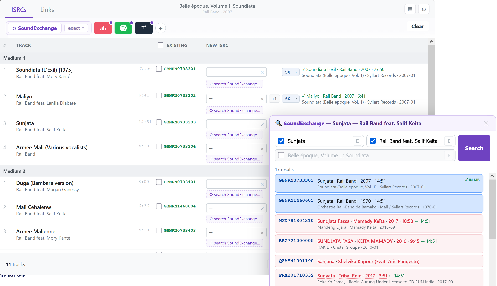
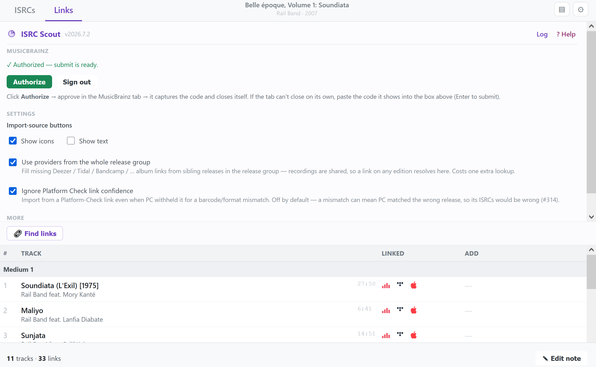

# ISRC Scout 

Self-contained ISRC editor that lives **on the MusicBrainz release page**. Reads the release's existing ISRCs, lets you fill in the missing ones from several sources, and submits them straight to MusicBrainz. With ISRC present, finds and adds **streaming links to the recordings**.

- Install: [stable](https://raw.githubusercontent.com/majkinetor/musicbrainz-userscripts/refs/heads/stable/userscripts/isrc_scout/isrc_scout.user.js) or [latest](https://raw.githubusercontent.com/majkinetor/musicbrainz-userscripts/refs/heads/main/userscripts/isrc_scout/isrc_scout.user.js)
    - Or via bundle: [String Theory](../string_theory/README.md)
- [Changelog](./CHANGELOG.md)
- [View users](https://musicbrainz.org/search/edits?auto_edit_filter=&order=desc&negation=0&combinator=and&conditions.0.field=type&conditions.0.operator=%3D&conditions.0.args=76&conditions.0.args=78&conditions.1.field=edit_note_content&conditions.1.operator=includes&conditions.1.args.0=ISRC+Scout)

More Screenshots

  

https://github.com/user-attachments/assets/7549eacf-8993-4fd7-ad17-2566ad827da0

## Features

- **[ISRC badge](#isrc-badge)** showing how many are missing
- **[ISRC](#isrc-editor)** — a per-track table of existing/new ISRCs with live validation
    - **[Import sources](#import-sources)** — fill the missing ISRCs from several providers
    - **[Delete existing ISRCs](#deleting-existing-isrcs)**
    - **[Per-track helpers](#per-track-helpers)** — per-row provider lookup with metadata match checks and highlighting
    - **[Submit to MusicBrainz](#submitting)** — one-time OAuth, then submit straight from the editor
- **[Links](#links)** — find and add streaming links to recordings 
  - Find links based on release external links and ISRCs 
  - [Batch ending or removing](#ending--removing) link relationship
- Using release group external links and [Platform Check](../platform_check/README.md) links

## ISRC badge

An **ISRC** button is injected next to the release title, showing how many tracks already have an ISRC (`✓ 12/12`) or pulsing pink when some are missing (`⚠ 9/12`). Click it to open the editor.

## ISRC editor

A table of every track with its existing ISRCs and an input for the new one. Live validation flags invalid (red), duplicate (orange), and good (green) values. The footer shows how many will be submitted.

### Import sources

| Button | Source | Auth | Notes |
| --- | --- | --- | --- |
| **⟳ SoundExchange** | [SoundExchange](https://isrc.soundexchange.com/) | none | Searches each track by title/artist, shows candidate ISRCs per row, auto-fills confident matches into empty fields. Searches are capped at **30 at a time** so SoundExchange doesn't block us — remaining tracks show a *"Not searched — click to load the next 30"* message; click any one to continue.|
| **Deezer** | `api.deezer.com` | none | Enabled when the release has a Deezer album relationship. Fetches each track's ISRC and maps by disc/position (title fallback). Deezer needs one request **per track**, so imports are capped at **50 tracks per batch** (a *"Deezer N/M — click to fetch the next 50"* prompt continues) to avoid spamming Deezer on huge releases. |
| **Spotify** | `isrchunt.com` | none | Enabled when the release has a Spotify album relationship. Delegates to ISRC Hunt (which does the Spotify lookup server-side) and scrapes the ISRCs from its result page |
| **Beatport** | `beatport.com` release page | none | Enabled when the release has a Beatport relationship. Beatport is Cloudflare-walled, so a direct cross-origin fetch is always blocked — instead the script opens the release in a brief **background tab** where the page (which the script also runs on) reads the ISRCs out of the embedded `__NEXT_DATA__` and hands them back, then the tab closes. Results are cached, so a repeat import (or one after you've simply visited the page yourself) is instant. |
| **Tidal** | `openapi.tidal.com` | app token (baked in) | Enabled when the release has a Tidal album relationship. Uses Tidal's official API with a built-in client-credentials app token (catalog access, **no user login**); maps each track's ISRC by disc/track number. |
| **Volumo** | `volumo.com/api/v1` | none | Enabled when the release has a Volumo relationship (or one Platform Check found via barcode). Clean unauthenticated API — one call returns every track's ISRC; no Cloudflare/token. Link-only, like the others. |
| **HDtracks** | `hdtracks.azurewebsites.net/api/v1` | none | Enabled when the release has an HDtracks relationship (or one Platform Check found via barcode). Clean unauthenticated, CORS-open API — one `/album/<id>` call returns every track's ISRC inline; no per-track fan-out, no token. The album id is a 24-char ObjectId; a barcode/UPC (e.g. from a legacy `valbum_code` rel) is resolved to it via search first. |

The **Deezer**, **Beatport**, **Tidal**, **Volumo** and **HDtracks** buttons each have a **▾** menu to *import from a custom album URL* — paste any matching album/release URL (or bare id) to import from it, even when the release has no such link. If the [`platform_check`](../platform_check/README.md) userscript is also installed and has found a URL for that platform, the menu also offers a one-click **"Use the &lt;platform&gt; URL Platform Check found"** option (skipped silently when `platform_check` isn't present). Spotify has no such menu: its import goes through ISRC Hunt, which resolves the MB release *from* the Spotify URL — so a custom or not-yet-in-MB URL does not work.

> A Platform Check link that PC **withheld for a barcode/format mismatch** is **not** used here by default (#314). In principle an ISRC identifies a *recording* and is independent of the release's barcode/format — but a barcode mismatch can equally mean PC matched the **wrong release** (e.g. a 1-track Beatport single by a same-prefixed artist), whose ISRCs would be wrong. To deliberately read ISRCs from a barcode/format-mismatched edition anyway, enable **⚙ Setup → Ignore Platform Check link confidence**. Genuine content mismatches (wrong track count, etc.) are always skipped, and an in-MB link or a custom URL you paste yourself is unaffected.

The import-source buttons can show as **brand icons, text labels, or both** — toggle under **⚙ Setup → Import-source buttons** (defaults to icons, to keep the toolbar compact). The **⟳ SoundExchange** *exact title/artist/release* toggles are collapsed behind a small **exact ▾** control (state remembered) for the same reason.

#### Spotify 

The script uses [ISRC Hunt](https://isrchunt.com), which does the Spotify lookup **server-side** (with its own credentials) and renders the ISRCs into a plain HTML table. The script fetches `isrchunt.com/spotify/importisrc?releaseId=<album url>`, scrapes that table, and maps the ISRCs to your tracks.

#### Beatport 

Beatport release pages embed the full tracklist — including each track's ISRC — in their `__NEXT_DATA__` hydration JSON, but the site is behind Cloudflare, so a `GM_xmlhttpRequest` from MusicBrainz is always challenged. To get around that the script **also runs on `beatport.com/release/*`**: when you import, it opens the release in a background tab, the in-page copy reads the ISRCs from `__NEXT_DATA__`, stashes them in shared storage for the MusicBrainz tab, and the tab closes itself. Tabs you (or Platform Check) open are harvested too but left open. Harvested ISRCs are cached per release.

#### Tidal

Uses Tidal's official API (`openapi.tidal.com`) with a baked-in client-credentials app token — app-level catalog access, so **no Tidal login is needed**. It reads `/albums/{id}/relationships/items`, taking each track's ISRC from the included track resources and the disc/track number from the relationship metadata.

### Per-track helpers

- **+1** — fill with the previous track's ISRC incremented by one.
- **ISRC lookup** 
Displays track metadata from the ISRC provider. It takes the ISRC in the row (entered or existing) and looks it up **on the selected provider**, showing that track's metadata (title · artist · length, mismatches highlighted) next to the row. It's menu lets you choose an available provider: SoundExchange (default) plus every other provider available for the release. Picking one re-skins **all** per-track buttons to that provider's icon (global for the release, not remembered). **Right-click** a button to inoke on all tracks. Providers with a global by-ISRC endpoint (**SoundExchange**, **Deezer**, **Tidal**) work on any release; the album-based ones (**HDtracks / Volumo / Beatport**) read the release's album (so they need its link, in MB or found by Platform Check) and match by ISRC.
- **⚙ search on SoundExchange** 
Open a panel where you can tweak the title/artist/release + exact toggles for SX. The panel has a **Search on SoundExchange ↗** link that runs the same query on the SoundExchange website.

To avoid overloading ISRC providers, lookup is not called automatically as you type or when values are imported from provider or set via **+1**. A field is verified on provider only when you **unfocus a manually-typed ISRC**, press the row's **ISRC lookup** button, or run the bulk **⟳ SoundExchange** search (as values picked from a SoundExchange without extra request). If SoundExchange shows a captcha or rate limit error, it is shown in the toolbar. Resolve captcha manually to continue.

#### Match checks & highlighting

Every SoundExchange result is checked against the MB track and **mismatching fields are highlighted in red** (wavy underline, with a tooltip):

| Field | Check |
| --- | --- |
| **Title** | word-set match (tolerates a couple of extra words, e.g. a version suffix) |
| **Artist** | word-set match either direction |
| **Year** | the recording year must be **≤ the MB release year (+1)** — a later recording can't be the source of release's ISRC |
| **Length** | flagged when it differs from MB by **> 10 s**; MB's length is shown inline (`↔ m:ss`) for comparison |

A result that passes all checks is the **best** match (blue, auto-filled when the field is empty); a length-only disagreement is a **warn** (yellow); a title/artist/year disagreement drops it out of the auto-fill running entirely.

### Deleting existing ISRCs

Check the box next to any existing ISRC and click **🗑 Delete checked**. Deletion goes through the MusicBrainz recording-edit form using your logged-in session (ISRC removal isn't a WS2 operation), and each removal is verified via the web service. Creates normal "Remove ISRC" edits — so you must be logged into musicbrainz.org.

### Bulk / Export (⇪)

- **Paste** one ISRC per line in track order (blank line skips a track), or target specific tracks: `3=USABC1234567`, `USABC1234567 | 1.3` (medium.track), or `1.3 USABC1234567`.
- **Apply to empty fields** / **Apply (overwrite)**.
- **Export text** (one per line) / **Export JSON** (`{ recordingMBID: "ISRC" }`) — copied to clipboard.

## Links

ISRC Scout also adds **streaming links to recordings** in the background. The **Links** tab shows two columns per track:

- **Linked** — what the recording already links to on MusicBrainz (brand-coloured icon per provider).
- **Add** — links found but not yet on MB.

### Providers

| Provider | How it resolves | MB link type |
| --- | --- | --- |
| **Deezer**, **Tidal** | by **ISRC** — a global by-ISRC lookup, so it works on any release whose tracks have ISRCs | free streaming / streaming |
| **Bandcamp**, **Apple Music** | by **album page** — the release's Bandcamp/Apple album link lists every track URL, matched to the tracklist by **position + title** (a title mismatch is skipped, never guessed) | free streaming / streaming |

A provider is offered for a track only when it's resolvable (Deezer/Tidal need that track's ISRC; Bandcamp/Apple need the release's album link) or the recording is already linked to it.

**Dead links aren't offered.** Deezer keeps an ISRC→track mapping even after it pulls the audio, so a by-ISRC lookup can return a track that no longer streams anywhere (Deezer reports it as unreadable, available in zero countries). Find links treats such a track as not found, so it won't offer a broken link to add.

### Finding & adding

- **🔗 Find links** resolves every track on the available providers and lights up the **Add** column with what's addable (a coloured icon = found, not yet linked). Providers resolve **in parallel** (each with its own light rate-limiting), and the album-based ones (Bandcamp / Apple Music) fetch the album page just once — so a full release resolves in a few seconds rather than one request at a time.
- On an **Add** icon: **left-click** opens the provider track · **right-click** adds it · **Ctrl + right-click** adds every link on that track · **Alt + right-click** adds that provider across all tracks. **➕ Add links** in the footer adds everything found at once.
- Adds happen **in the background** via MusicBrainz's internal edit API over your **logged-in session** — no OAuth needed (unlike ISRC submission); auto-applied if you're an auto-editor, otherwise queued. The edit note matches ISRC Scout's standard format.

### Ending & removing

On a **Linked** icon, **left-click** opens the provider track. **Right-click toggles the relationship's *ended* flag** — use it when a release is taken down and its streaming links no longer resolve ([MB style](https://musicbrainz.org/doc/Style/Relationships/URLs#When_to_remove)); an ended link is shown **faded**, and right-clicking it again reverts it. **Ctrl + right-click** ends the whole track, **Alt + right-click** ends that provider everywhere.

Actual **removal** is on **middle-click** (right-click's modifiers already scope the *ended* toggle): **middle-click** removes that link · **Ctrl + middle-click** removes all on the track · **Alt + middle-click** removes that provider everywhere.

### Use providers from the whole release group (option)

Releases in a release group are often split by platform (one edition carries the Deezer link, another Spotify/Tidal, another Bandcamp). Since the recordings are shared, **⚙ → "Use providers from the whole release group"** (off by default) fills in any provider link the current edition is missing from its **sibling releases** — for both ISRC import and track links. A small **purple dot** marks links pulled this way, with a tooltip naming the sibling release.

## Shortcuts

Keyboard, in the editor / Links modal:

| Key | Action |
|---|---|
| `Esc` | Close the open sub-panel/popup, else the modal (ignored while typing in a field) |
| `Esc` | Close the SoundExchange search panel |
| `Enter` | Submit the focused **Add link** URL / code input, or run the SoundExchange search |

Modifier-clicks on the **Links tab** Add / Linked icons (see [links tab](#links) for the full description):

| Click | Add column | Linked column |
|---|---|---|
| left-click | — | Open the provider track |
| right-click | Add that one link | Toggle *ended* on that link (faded when ended; right-click reverts) |
| `Ctrl`/`⌘` + right-click | Add every link on that track | End every link on that track |
| `Alt` + right-click | Add that provider across all tracks | End that provider across all tracks |
| middle-click | — | Remove that one link |
| `Ctrl`/`⌘` + middle-click | — | Remove every link on that track |
| `Alt` + middle-click | — | Remove that provider across all tracks |

## Submitting

ISRC submission to MusicBrainz **requires OAuth**:

1. In the editor click **⚙ Setup → Authorize**. A MusicBrainz tab opens, approve, done.
2. Fill in ISRCs, click **Submit to MusicBrainz**.

Credentials and tokens are stored in the userscript's local storage (`GM_setValue`). **Sign out** in Setup clears the stored token.

