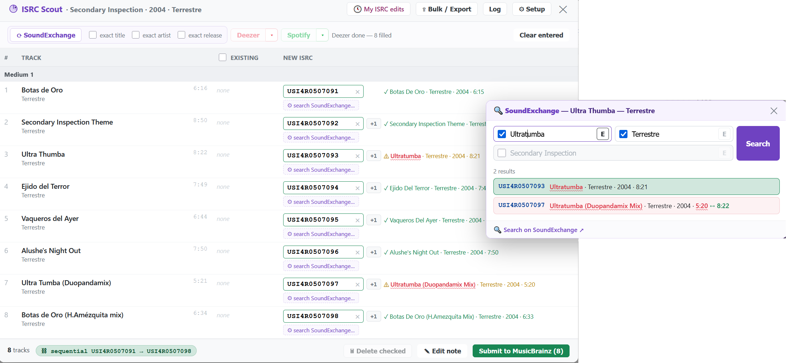

# ISRC Scout

Self-contained ISRC editor that lives **on the MusicBrainz release page**. Reads the release's existing ISRCs, lets you fill in the missing ones from several sources, and submits them straight to MusicBrainz.

## The button

An **ISRC** button is injected next to the release title, showing how many tracks already have an ISRC (`✓ 12/12`) or pulsing pink when some are missing (`⚠ 9/12`). Click it to open the editor.

## The editor

A table of every track with its existing ISRCs and an input for the new one. Live validation flags invalid (red), duplicate (orange), and good (green) values. The footer shows how many will be submitted.

### Import sources

| Button | Source | Auth | Notes |
| --- | --- | --- | --- |
| **⟳ SoundExchange** | [SoundExchange](https://isrc.soundexchange.com/) | none | Searches each track by title/artist, shows candidate ISRCs per row, auto-fills confident matches into empty fields. Searches are capped at **30 at a time** so SoundExchange doesn't block us — remaining tracks show a *"Not searched — click to load the next 30"* message; click any one to continue.|
| **Deezer** | `api.deezer.com` | none | Enabled when the release has a Deezer album relationship. Fetches each track's ISRC and maps by disc/position (title fallback). Deezer needs one request **per track**, so imports are capped at **50 tracks per batch** (a *"Deezer N/M — click to fetch the next 50"* prompt continues) to avoid spamming Deezer on huge releases. |
| **Spotify** | `isrchunt.com` | none | Enabled when the release has a Spotify album relationship. Delegates to ISRC Hunt (which does the Spotify lookup server-side) and scrapes the ISRCs from its result page |

The **Deezer** button has a **▾** menu to *import from a custom album URL* — paste any Deezer album URL (or bare id) to import from it, even when the release has no Deezer link. If the [`platform_check`](../platform_check/README.md) userscript is also installed and has found a **Deezer** URL for the release, the menu also offers a one-click **"Use the Deezer URL Platform Check found"** option (skipped silently when `platform_check` isn't present). Spotify has no such menu: its import goes through ISRC Hunt, which resolves the MB release *from* the Spotify URL — so a custom or not-yet-in-MB URL does not work.

### Per-track helpers

- **+1** — fill with the previous track's ISRC incremented by one.
- Click any SoundExchange candidate to use it, or **⚙ refine search** to open a panel where you can tweak the title/artist/release + exact toggles. The panel has a **Search on SoundExchange ↗** link that runs the same query on the SoundExchange website.
- Track titles link to the MB recording. **Any** value set in a field — typed, **+1**, or imported from Deezer / Spotify / SoundExchange — is verified on SoundExchange inline (cached) with the field-level match highlighting below. ISRCs duplicated across different recordings are flagged pink.

#### Match checks & highlighting

Every SoundExchange result is checked against the MB track and **mismatching fields are highlighted in red** (wavy underline, with a tooltip):

| Field | Check |
| --- | --- |
| **Title** | word-set match (tolerates a couple of extra words, e.g. a version suffix) |
| **Artist** | word-set match either direction |
| **Year** | the recording year must be **≤ the MB release year (+1)** — a later recording can't be the source of release's ISRC |
| **Length** | flagged when it differs from MB by **> 10 s**; MB's length is shown inline (`↔ m:ss`) for comparison |

A result that passes all checks is the **best** match (blue, auto-filled when the field is empty); a length-only disagreement is a **warn** (yellow); a title/artist/year disagreement drops it out of the auto-fill running entirely.

### Deleting existing ISRCs

Check the box next to any existing ISRC and click **🗑 Delete checked**. Deletion goes through the MusicBrainz recording-edit form using your logged-in session (ISRC removal isn't a WS2 operation), and each removal is verified via the web service. Creates normal "Remove ISRC" edits — so you must be logged into musicbrainz.org.

### Bulk / Export (⇪)

- **Paste** one ISRC per line in track order (blank line skips a track), or target specific tracks: `3=USABC1234567`, `USABC1234567 | 1.3` (medium.track), or `1.3 USABC1234567`.
- **Apply to empty fields** / **Apply (overwrite)**.
- **Export text** (one per line) / **Export JSON** (`{ recordingMBID: "ISRC" }`) — copied to clipboard.

## Submitting (one-time authorization)

ISRC submission to MusicBrainz **requires OAuth**:

1. In the editor click **⚙ Setup → Authorize**. A MusicBrainz tab opens, approve, done.
2. Fill in ISRCs, click **Submit to MusicBrainz**.

Credentials and tokens are stored in the userscript's local storage (`GM_setValue`). **Sign out** in Setup clears the stored token.

### Spotify import

The script uses [ISRC Hunt](https://isrchunt.com), which does the Spotify lookup **server-side** (with its own credentials) and renders the ISRCs into a plain HTML table. The script fetches `isrchunt.com/spotify/importisrc?releaseId=<album url>`, scrapes that table, and maps the ISRCs to your tracks.
