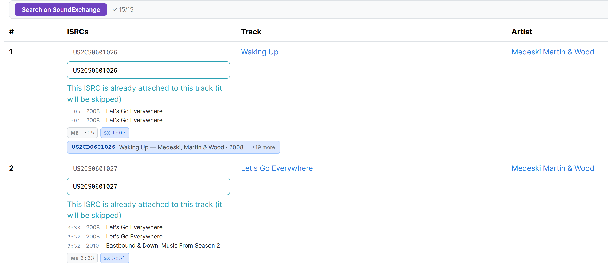

# MagicISRC SoundExchange Search

Scripts adds batch lookup on the [MagicISRC](https://magicisrc.kepstin.ca/) using the [SoundExchange](https://isrc.soundexchange.com/) ISRC database.

- [Install at Greasy Fork](https://greasyfork.org/en/scripts/577713-magicisrc-soundexchange-quick-search)

## Features

### Header

- Search on SoundExchange button (header):
- Searches all rows, shows chips with title/artist/release info
- Options: auto-fill / exact title / exact artist options (persisted in localStorage)

### Track details

- MB and SX duration badges
- "Appears on" releases list - shows all MB releases that are associated with the recording along with the release year and length of tracks
- "Search on SoundExchange" option to invoke search panel for the track
- +1 button - set track ISRC as 1 higher than previous track
- On losing focus on ISRC input field, queries SX and shows result inline with mismatch highlights
- Highlights: 🟠 name mismatch, 🟡 duration mismatch, 🔵 no ISRC present in MB

### Search Panel

Shows all search results for the selected track.

- Search by release (combo with all page releases), title, artist fields; release is always manually set
- Checkboxes to search with exact release / title / artist (using quoted strings in the background)
- Highlights: 🟢 currently selected, 🔵 best match, 🟡 duration mismatch

### Inline chip

Click on the chip to set ISRC for the track. Click "+N more" button in the right corner to open search panel with all results.

Format:

- ISRC · Title — Artist · Year with orange highlights on mismatches
- Release name, label, release year
