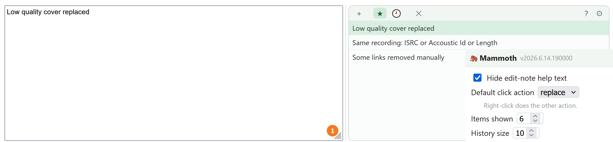

# Mammoth 

Mammoth keeps your reusable edit notes in a compact panel **beside** the edit-note field on every edit form, and remembers the ones you submit.

- Install: [stable](https://raw.githubusercontent.com/majkinetor/musicbrainz-userscripts/refs/heads/stable/userscripts/mammoth/mammoth.user.js) or [latest](https://raw.githubusercontent.com/majkinetor/musicbrainz-userscripts/refs/heads/main/userscripts/mammoth/mammoth.user.js)
- [Changelog](./CHANGELOG.md)



Every MusicBrainz edit form has an **Edit note** field. Power editors reuse the same notes constantly. Mammoth makes that painless.

## Features

- **Per type notes**<br>
Keep saved notes and history **separate per edit-note type** (release / artist / recording…). A small chip in the toolbar shows the current type. When off (default), all notes share one pool shown everywhere.
- **History**<br>
Remembers the last **N edit notes you submit** (default 10, up to 50), most-recent-first and de-duplicated. 
- **Saved notes**<br>
    - **＋** saves the current text; in **History**, `★` on a row moves it to saved notes. Reorder by **drag** (the `⠿` handle on the right, shown on hover) and delete with `🗑`.
    - **Note search** — narrows the list to notes containing typeed phrase; `Enter` uses the first result, `Esc` clears.
    - **Quick buttons** — click `★` on a saved note to pin it as a button below the input field
    - **Sort** — **Manual** (using drag&drop, the default), **Most used** or **Recent**
- **Import / export** — batch load/export multiple notes; it is contextual for given input type; entity fields like Artist/Label keep their MBID in the export, so a re-import resolves the real entity
- **Compact, one-line rows**<br
With the full note on hover; choose how many show before scrolling (the list hides its scrollbar — the mouse wheel scrolls it).
- **Replace or Insert**<br>
Click does your default (replace/append); right-click does the other. Append skips a line already present in the field. Ctrl/⌘ + ↑/↓ cycles saved notes; **Ctrl/⌘ + B / I** wrap the selection — or the word at the caret — in bold / italic markup.
- **Resizable**<br>
The native edit-note field is widened and centered (it spans the full form width on the release editor). **Drag the separator** to resize the field vs. the panel, and the field's own height; both are remembered.
- **Minimized mode**<br>
The **–** button (left of **?**) collapses the panel to a small Mammoth icon in the field's top-right corner, giving the edit note the full width. **Hover** the icon to float the panel back in (click it to pin it open); **⤢** restores it. The mode is remembered across edit pages.
- **Mammoth babies** - The same save/reuse on **other controls** — catalog number, label, artist, status, language, script, country, primary type

## Mammoth babies

The same save/reuse on **other controls** — catalog number, label, artist, status, language, script, country, primary type. 

A small 🦣 pin sits in each field; click it to recall values you've saved for that field (stored per field, shared across releases). The pin opens a compact panel with a toolbar:

- `＋` - save the current value; entity fields (Label, Artist) save the selected MBID, so a recalled value resolves the real entity
- `✕` - clear the field

The pin auto-shifts left of a field's native control (the `<select>` arrow or an autocomplete's magnifier); `data-mmth-dx="<px>"` overrides that nudge for a specific control. Other scripts can opt a control in by tagging it `class="mmth-pin"` (optional `data-mmth-key` / `data-mmth-label`). Stored separately under `mammoth-fields:data`.

Note actions:

 - `★` pins a value as an always-visible **button under the field** (rounded "tag" buttons that wrap to new rows, labelled with the value truncated to the configured length — see **`⚙` "Button label length"**)
 - `◉` marks one entry as the **default** (auto-fills the field when it's empty)
 - `🗑` delete note
 - `⠿` drag to reorder

## Keyboard shortcuts

In the edit-note field (and Mammoth's panel):

| Key | Action |
|---|---|
| `Ctrl`/`⌘` + `Enter` | Submit the edit (clicks the page's *Enter edit* / submit button) |
| `Ctrl`/`⌘` + `↑` / `↓` | Cycle through your saved notes, replacing the field |
| `Ctrl`/`⌘` + `B` | Wrap the selection — or the word at the caret — in **bold** markup |
| `Ctrl`/`⌘` + `I` | Wrap the selection — or the word at the caret — in *italic* markup |

## Settings 

Accessed using the ⚙ button. The config window has **Settings** and **Import / Export** tabs and can be **dragged by its header** to move it out of the way.

| Setting | Default | Notes |
|---|---|---|
| **Scope per resource** | off | Keep notes separate per edit-note type (release / artist / …). |
| **Hide help text** | off | Hides MusicBrainz's help paragraphs above the field. |
| **Default click action** | `replace` | What a left-click does (`replace`, or `append`). Right-click does the other. |
| **Insert new line when appending** | on | Append a blank line before note. |
| **Show note search** | off | Show the search box above the note list (for big lists). |
| **Sort saved notes** | `Manual` | `Manual` (drag order), `Most used`, or `Recent`. |
| **Button label length** | `24` | Character length of the pinned quick-buttons' labels (4–80), for both the main and baby pins. |
| **Items shown** | `6` | How many list rows to render before the list scrolls. |
| **History size** | `10` | How many submitted notes to remember (1–50). |
| **Show mammoth babies** | on | Field memory on other controls (catalog №, label, artist, status…). Toggles on/off live. |

The `⚙` window has two tabs: **Settings** (above) and **Import / Export** (paste to import many notes, or **Export all** to the clipboard — with a *1 note per line* / *empty line separates notes* toggle that applies both ways).

## Using Mammoth from another userscript

Mammoth enhances **any `textarea.edit-note` on the page**, not just MusicBrainz's own — a `MutationObserver` picks up fields added dynamically too. So another userscript that has its own edit-note field (e.g. [Art Station](../art_station)'s "Enter edit" dialog) can host the full Mammoth panel **with no API and no changes to Mammoth** — it's pure convention:

1. **Give your edit-note field `class="edit-note"`.** Mammoth wraps it (`.mmth-wrap`) and attaches the saved-notes / history panel.

   ```html
   <textarea class="edit-note"></textarea>
   ```

2. **History capture is automatic** if your submit button matches Mammoth's heuristic — a document-wide click on a button whose text starts with `enter edit` / `submit` / `add edit` / `save`, or that has class `submit`, records the field into history. (A button labelled e.g. *"Dry run"* deliberately won't, so previews aren't recorded.)

3. **You own the layout.** Mammoth lays the field out beside a ~300px panel (`.mmth-side`) with a drag splitter (`.mmth-vsep`); scope your own CSS to fit it into your container — e.g. hide the splitter and give the wrap a bottom margin inside a modal:

   ```css
   #your-dialog .mmth-wrap { margin: 0 0 12px; max-width: none; gap: 10px; }
   #your-dialog .mmth-vsep { display: none; }
   ```

When Mammoth isn't installed the field is just a plain textarea, so the integration is a no-op.

Mammoth baby pin auto-shifts left of a field's native control (the `<select>` arrow or an autocomplete's magnifier); `data-mmth-dx="<px>"` overrides that nudge for a specific control. Other scripts can opt a control in by tagging it `class="mmth-pin"` (optional `data-mmth-key` / `data-mmth-label`). Stored separately under `mammoth-fields:data`.

##  Notes

- Inspired by [Elephant Editor](https://github.com/jesus2099/konami-command/blob/master/mb_ELEPHANT-EDITOR.user.js).
