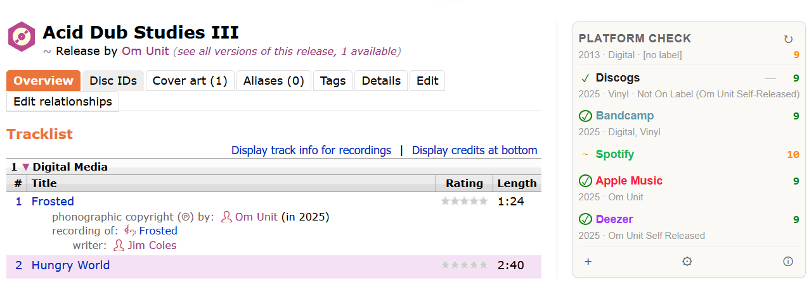

# Platform check

Find URLs for a particular MusicBrainz release on online platforms, verify track counts, surface label / year / format alongside.

- [Install latest from GitHub](https://raw.githubusercontent.com/majkinetor/musicbrainz-userscripts/refs/heads/main/userscripts/platform_check/platform_check.user.js)

## Overview

The userscript runs on `musicbrainz.org/release/*` and tries to locate each release on a supported set of platforms. When the release already has a platform URL in MB's URL relationships it is used directly. Otherwise, it falls back to a chain of sources — platform APIs, Wikidata, then generic web search — and verifies each candidate by track-count and title-similarity match against MB's data.

Once a URL is settled, the script fetches the platform's metadata (track count, year, label, format where available) and shows it alongside the MB-side numbers so you can see at a glance whether a candidate looks right. Results are cached per release so revisiting a page does no outbound traffic until you click ↻.

Platforms with ✓ marker have link result. If the marker is circled, the link is already in the MB's URL relationships.

## Supported platforms

|  Platform   |                    Search source                    |          Track verify          | Wikidata cross-ref |
| ----------- | --------------------------------------------------- | ------------------------------ | ------------------ |
| Discogs     | Discogs API (`api.discogs.com/database/search`)     | Discogs API release detail     | —                  |
| Bandcamp    | Bandcamp's own search → DDG / Brave fallback        | JSON-LD on the album page      | —                  |
| Spotify     | DuckDuckGo / Brave (`site:open.spotify.com/album/`) | `/embed/album/<id>` HTML parse | P2205              |
| Apple Music | iTunes Search API (`itunes.apple.com/search`)       | iTunes Lookup API              | P5121              |
| Deezer      | Deezer API (`api.deezer.com/search/album`)          | Deezer API album detail        | —                  |

Discogs has few specifics:

1. It is **format-aware** — for example, when MB release format has type CD, the first attempt tries to find CD release on Discogs, so a vinyl Discogs entry doesn't shadow an existing CD one; if that returns nothing, the script retries without the format filter.
1. It checks if any master release on Discogs is present as link on MB's release group.

## Features

- Info about MB's release year, format and label and track number in the header
- **Insert links to release**: opens *edit* page of the release and inserts one or more links:
    - `+` click - batch insert all links that have `✓` marker
    - `✓`click - insert only particular link next to the marker
- **Options**:
    - Toggle usage of each supported platform independently
    - Reorder providers
- **Refresh** (`↻`): clears the cache for the current release and re-runs every enabled scanner.
- **Diagnostic log (`ⓘ`)**: every step of every scanner is logged with per-source filter chips so you can isolate a single platform's chain.
