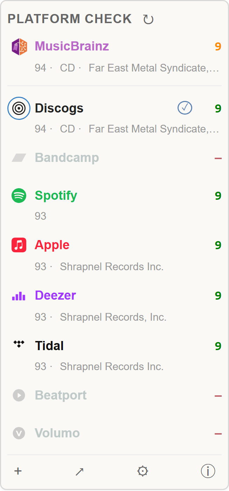
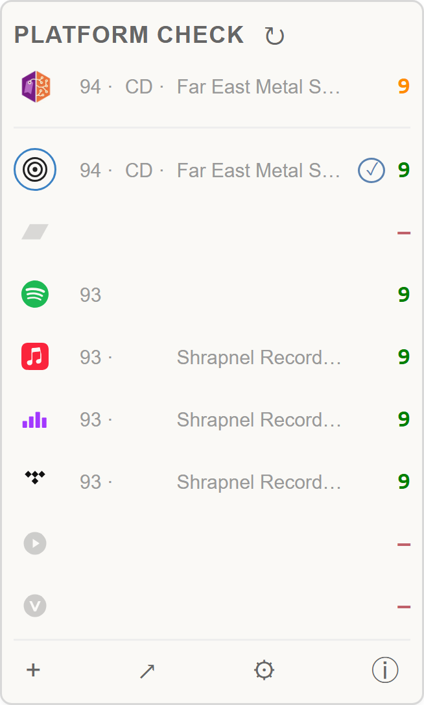

# Platform check 

Find URLs for a particular MusicBrainz release on online platforms, verify track counts, surface label / year / format alongside.

- Install: [stable](https://raw.githubusercontent.com/majkinetor/musicbrainz-userscripts/refs/heads/stable/userscripts/platform_check/platform_check.user.js) or [latest](https://raw.githubusercontent.com/majkinetor/musicbrainz-userscripts/refs/heads/main/userscripts/platform_check/platform_check.user.js)

## Overview

The userscript runs on `musicbrainz.org/release/*` and tries to locate each release on a supported set of platforms. When the release already has a platform URL in MB's URL relationships it is used directly. Otherwise, it falls back to a chain of sources — platform APIs, Wikidata, then generic web search — and verifies each candidate by track-count and title-similarity match against MB's data.

Once a URL is settled, the script fetches the platform's metadata (track count, year, label, format where available) and shows it alongside the MB-side numbers so you can see at a glance whether a candidate looks right. Results are cached per release so revisiting a page does no outbound traffic until you click ↻.

**Barcode (UPC) matching.** When the MB release has a barcode (read from the release page, with the MB API as a fallback), providers that support a barcode lookup try it **first** for an exact match before any text search — **Deezer** (`api.deezer.com/album/upc:`), **Tidal** (`/v2/albums?filter[barcodeId]`), **Apple** (`itunes.apple.com/lookup?upc=`), **Volumo** (`/album_by_icpn`) and **HDtracks** (`/albums/search?q=<UPC>`). This avoids the ambiguity of title/artist search when a barcode is available, and prefers the *exact* edition over a Wikidata/search match that may be a different barcode.

**Barcode accuracy (#182).** MusicBrainz treats a different barcode as a different release, so a found link with a mismatching barcode is the wrong entity per the [URL style guidelines](https://musicbrainz.org/doc/Style/Relationships/URLs#Which_entity_to_link_to). Platform Check now:

- Captures the found item's barcode where the provider exposes it (Deezer, Tidal, Volumo, HDtracks, authed Beatport, **Discogs** via its `identifiers`, **Bandcamp** via `TralbumData.current.upc`; Apple/Spotify APIs don't) and, when it differs from MB's, marks the row with a **subtle amber bar on the left edge** — the barcode itself is shown only in the row tooltip + the diagnostic log, never in the dashboard.
- **Discogs** also searches **barcode-first** (`?barcode=<UPC>`) before its text search when MB has a barcode, so the exact pressing is preferred.
- Runs **[SAMBL](https://sambl.lioncat6.com)** (`/api/find?query=<UPC>&type=upc`) as a parallel barcode resolver. Its unique contribution here is the exact-barcode **Spotify** album (Spotify has no other unauthenticated UPC route); Tidal/Deezer already do barcode-first themselves, and its Apple result isn't barcode-exact so it's not trusted there.
- Adds a setup option **"Check barcodes for link confidence"** (off by default) with two modes:
  - **if they exist** — withhold from `+`/`↗` only links whose barcode is *known and differs*.
  - **strictly** — only add *barcode-confirmed* links, i.e. also withhold links whose barcode can't be checked (Apple/Spotify, which don't expose a UPC).
  - The left-bar indicator shows known mismatches regardless of this setting.
  - A **withheld** link (by either the barcode or format check) is shown **grayed out and non-clickable** — like any other mismatch — instead of a clickable ✓ that silently does nothing.

**Format accuracy (#182).** MusicBrainz treats a different format (medium) as a different release, so a digital-store link doesn't belong on a CD/Vinyl release per the same [URL guidelines](https://musicbrainz.org/doc/Style/Relationships/URLs#Which_entity_to_link_to). Only **Bandcamp** and **Discogs** expose a real format; every other provider is a digital-only storefront, so an absent format counts as **Digital**. Platform Check adds a setup option **"Use format for link confidence"** (off by default) with two modes:

- **if they exist** — withhold from `+`/`↗` only links whose format is *known and incompatible* with the MB release (e.g. a Spotify/Apple/Tidal link on a CD release; a Bandcamp/Discogs edition whose parsed format shares no medium with MB's).
- **strictly** — also withhold links whose format can't be determined (a Bandcamp/Discogs parse that yielded no format).
- A **subtle violet bar on the left edge** marks incompatible rows while the option is on (digital-on-physical is common enough to be noise otherwise). Bandcamp/Discogs editions that *include* MB's medium (e.g. Bandcamp "Digital, CD" on a CD release) are compatible and pass.

Link availability is determined by the icon and text color:

1. Color - link is found
1. Gray - link is found but details do not match
1. Faded - link is not found
1. Circled - link exists in MB relationships

Mouse click works as follows:

1. **Left click** 
    1. Title - Open link if found, open search for provider if not found (use [↗] button in the footer to open all)
    1. Icon - Add link to the MB relationships (use [+] button in the footer to add all)
1. **Right click** 
    1. Title - Open search for provider

## Supported platforms

|  Platform   |                    Search source                    |          Track verify          | Wikidata cross-ref |
| ----------- | --------------------------------------------------- | ------------------------------ | ------------------ |
| Discogs     | Discogs API (`api.discogs.com/database/search`)     | Discogs API release detail     | —                  |
| Bandcamp    | Bandcamp's own search → DDG / Brave fallback        | JSON-LD + og:description (hidden tracks) | —         |
| Spotify     | DuckDuckGo / Brave (`site:open.spotify.com/album/`) | `/embed/album/<id>` HTML parse | P2205              |
| Apple Music | iTunes Search API (`itunes.apple.com/search`)       | iTunes Lookup API              | P5121              |
| Deezer      | Deezer API (`api.deezer.com/search/album`)          | Deezer API album detail        | —                  |
| Tidal       | **barcode** (`/albums?filter[barcodeId]`) → Tidal API searchResults | Tidal API album detail | P4577              |
| Beatport    | Wikidata → DDG / Brave (`site:beatport.com/release/`) | — (unverifiable, see below)  | P11312             |
| Volumo      | **barcode** (`/album_by_icpn`) → Volumo API search  | Volumo API album detail        | —                  |
| HDtracks    | **barcode** (`/albums/search?q=<UPC>`) → API search | HDtracks API album detail      | —                  |

**Bandcamp hidden tracks (#183).** A Bandcamp album can have bonus tracks that are *download-only* (not in the streaming player). The JSON-LD `numTracks` only counts the streamable ones, but the `og:description` meta tag ("N track album") carries the real total. Platform Check reports that true total, logs how many are hidden, and marks the count in the dashboard with a small superscript **ⁿ** (hover for "N download-only track(s) hidden from streaming"). So a Bandcamp release that streams fewer tracks than it actually contains no longer looks like a smaller release than MB.

**Bandcamp barcode (#194).** Bandcamp's UPC is in the page's `TralbumData.current.upc` (embedded in the `data-tralbum` attribute, not the JSON-LD). Platform Check reads it and feeds the same capture/amber-bar/strict-vs-if-they-exist machinery as the other providers — there's no barcode *search* (Bandcamp has none), so it's capture-only like Discogs. Two caveats baked in: Bandcamp barcodes are hand-entered and **often absent** (so an absent barcode is only withheld in *strict* mode), and per [Harmony](https://github.com/kellnerd/harmony/issues/42) the digital `current.upc` can coincide with a **physical package's** barcode — when it does it's the package's, not the digital release's, so it's **ignored** (logged) rather than used.

Discogs has few specifics:

1. It is **format-aware** — for example, when MB release format has type CD, the first attempt tries to find CD release on Discogs, so a vinyl Discogs entry doesn't shadow an existing CD one; if that returns nothing, the script retries without the format filter.
1. It checks if any master release on Discogs is present as link on MB's release group.

Tidal and Beatport specifics:

1. **Tidal** uses the official API with a baked-in client-credentials app token (catalog access, **no user login**). Track count, year and label are verified like the other API providers.
1. **Beatport** is **Cloudflare-walled**, so its pages can't be fetched to verify a track count. It resolves via an existing MB relationship, Wikidata (P11312), or a web-search hit (best slug-vs-title match) — but a search-found link is surfaced as an **unverified** match (`?`), and unverified rows are excluded from the `+` insert and `↗` open-all actions.
1. **Volumo** has a clean, unauthenticated JSON API (no Cloudflare/token). It resolves by the MB rel, then the release **barcode** (exact), then artist+album search, with the track count verified from the album. Like HDtracks, MB doesn't auto-classify volumo.com, so the `+` insert force-sets the **purchase for download** type. (ISRC Scout can import a Volumo release's ISRCs from the link this finds.)
1. **HDtracks** (high-resolution download store) has a clean, unauthenticated, CORS-open JSON API (no Cloudflare/token). It resolves by the MB rel, then the release **barcode** (`/albums/search?q=<UPC>`, exact), then artist+album search, with the track count verified from the album. The new canonical URL is `https://www.hdtracks.com/#/album/<id>`; the thousands of legacy MB rels (`valbum_code=<UPC>`, slug-id, artist page) are recoverable by barcode. MB has no dedicated HDtracks link type ([MBS-9023](https://tickets.metabrainz.org/browse/MBS-9023)) and doesn't auto-classify the host, so the `+` insert force-sets the relationship type to **purchase for download** (id 74). (ISRC Scout can import an HDtracks release's ISRCs from the link this finds.)

## Features

- Info about MB's release year, format and label and track number in the header
- **Insert links to release**: opens *edit* page of the release and inserts one or more links:
    - `+` click - batch insert all links that have `✓` marker
    - `✓`click - insert only particular link next to the marker
    - On the edit page it fills the **edit note** (script name/version + the links added) and shows a small confirmation next to the *External links* heading — then you review and click **Enter edit**.
- **Open all found** (`↗`): opens each **confirmed** (`✓`) platform page that isn't already in MB in its own new tab (plus the Discogs master if not yet added). Track-count mismatches (`~`) and unverifiable links (`?`, e.g. Beatport) are skipped — same bar as the `+` insert. **NOTE**: Watch for browser blocking multiple pop-ups!
- **Options**:
    - Toggle usage of each supported platform independently
    - Reorder providers
- **Refresh** (`↻`): clears the cache for the current release and re-runs every enabled scanner.
- **Diagnostic log (`ⓘ`)**: every step of every scanner is logged with per-source filter chips so you can isolate a single platform's chain.
